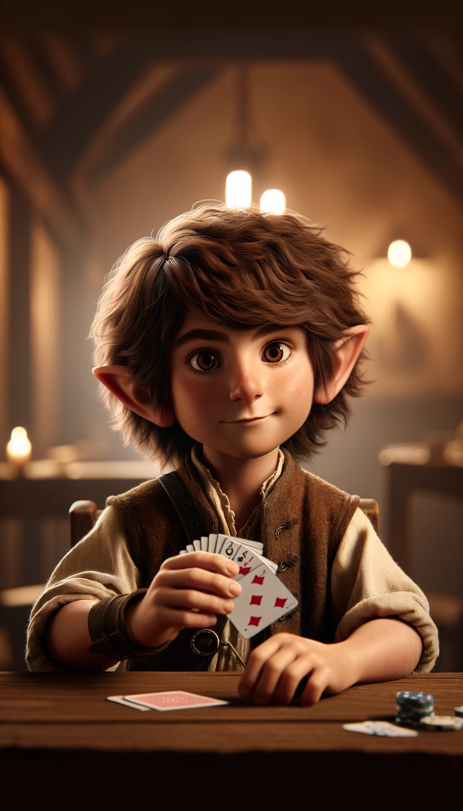
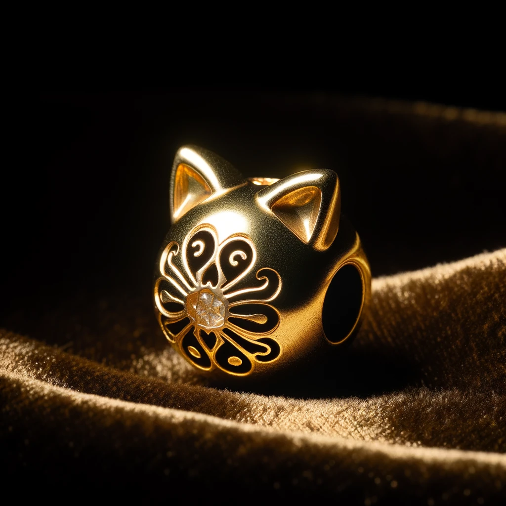

# Prolog

Gudo "Koralik" (niziolek) pochodzi z Krainy Zgromadzen - rodzimych ziem niziolkow.

Moja przepowiednia:

> Strzez sie zwierza z pol i czerwonej bestii

Ma 26 lat (19 w ludzkich), jest poczatkujacym szulerem. Aktualnie znajduje sie w przytulku swiatyni Szaliji w Szarych Gorach - dokladnie Reinsfled (bardzo daleko od Krainy Zgromadzen (6 miesiecy z buta)) - gdzie opiekuje sie nami kaplanka - siostra Eliza - ciepla i opiekuncza kobieta - jej dlonie o kojacym dotyku zdolnym leczyc najciezsze rany fizyczne i psychiczne; oraz Cadfelt - czlowiek ktory wydaje sie jest stary od zawsze - zawsze siwe wlosy, zawsze przygarbione plecy, zawsze zmarszczki na twarzy.

Inni gracze:

- Joseph Muller (Krisu) (sluga) (czlowiek) (sluga w przytulku)
- Thet-An Naen (Janek) (bajarz) (elf) (chlopiec w przytulku - brat Lin'a)
- Mor'Ol'Lin (Kuba) (podrzegacz) (elf) (chlopiec w przytulku - brat Naen'a)
- Eastern Rion (Maciek) (cyrkowiec) (elf) (chlopiec z karczmy)

Cecha fizyczna: Wszystkie wlosy sie kreca
Cecha psychiczna: Dziecinny

Moj przedmiot - zloty zeton w ksztalcie koralika z kocimi uszami

# Sesja 1 - 29.03.2024

W Reinsfled zycie toczy sie wlasnym rytmem. Nikt tu za bardzo nie przyjezdza, nikt nie odjezdza, wszystko jest statyczne.

W ogrodzie kolo karczmy siedzi dwoch braci elfow (Naen i Lin). Kloca sie jak to bracia. Naen tworzy wysmiewcze rymy o Lin-ie kiedy ten grzebie patykiem w ziemi tworzac projekt ulotek politycznych.

Cadflet, ich opiekun, przychodzi zdenerowwany - "Dlaczego sie nie zajmujecie pieleniem moich poletek ziol leczniczych?" i zabiera im pioro i patyk i zagania do roboty.

---

Joseph siedzi na rynku, nic sie nie dzieje wiec oddaje sie swojemu ulubionemu zajeciu - malowaniu. Maluje swoja cele w ktorej dawien dawna siedzial. Do Josepha podchodzi kaplanka Eliza. Prosi go o pomoc azaliz onegdaj na jutro.

---

Rion jest w karczmie razem ze mna. Ja siedze sobie i pokazuje Rionowi sztuczke karciana. Probuje go namowic na zaklad za szylinga ale odmawia. Wtem przychodzi do mnie wysoki (2 metrowy) zakapturzony mezczyzna i proponuje partie pokera. Wejscie 1zk a ja stawiam swoje kosci (z kosci). Widze ze mezczyzna uklada karty ale ja jestem w stanie je mniej wiecej policzyc.

---

Josephowi malowanie zostaje przerwane przez Naen'a. Naen probuje dowiedziec sie co Joseph maluje ale nie wychodzi mu - bardziej obraza Josepha niz okazuje mu respekt.

Lin poszedl szukac brata ktory nagle zniknal z zadania zbierania ziol na poletkach Cadfelta. Naen i Joseph widza Lina nadchodzacego ze strony ryneczku wiec rozchodza sie mowiac ze spotkaja sie w karczmie.

---

W karczmie - Rion krzyczy na Naen'a zeby nie chodzil po mokrym. Naen wskakuje na stol upierdalajac go calego blotem. Lin to samo. Gram z nieznajomym i widze ze mam fula a on tylko pare. Mowi "Zaraza..." i odchodzi. Wygralem zloata korone :3

Naen probuje nieznajomego zaczepic ale tamten sie nie daje. Wchodzi lutniarz - gladki, dobrze ubrany, czysty. Naen go zaczepia (probuje pisac opowiesci na podstawie historii nieznajomych).

Wielki mezczyzna z dwoma mieczami siada przy innym stole, tam gdzie jest najbardziej pusto. Lutniarz siada obok niego i gadaja o swoich przygodach. Lutniarz jest zywy a wiedzmin wycofany.

---

Do karczmy zaczynaja sie zbierac ludziska. Miedzy innymi Torvald - czlowiek czynu a nie mowy, potem przychodzi Tobiarz - mlynarz, roztrzepaniec, zyczliwy.

Po jakims czasie przychodzi rodzina pszczelazy - Wheelowie - sa nizolkami (cala rodzina 7 osob).

Po jakims czasie przychodzi Armin - karczmienny stajenny. Urodzil sie z reka do zwierzat.

Ostatni wpada Gerard - wlasciciel destylarni w wiosce.

Wioskowe panienki i panny tez przyszly i duza czesc z nich zaczela sie interesowac Jaskierem (lutniarz).

---

Jaskier dostaje od Nean'a kartke z jego tekstem - jest zachwycony ale jednak ma pare uwag do tego tekstu ktory dostal.

Ze strony panien slychac ochy i achy "Nean idzie do tego przystojniaka, po co, dlaczego? Ahhhh..."

Jaskier pochwala Nean'a i w trakcie pochwalania go zaczyna grac na lutni i idzie na srodek karczmy. Nean nie moze sie nacieszyc tym ze zostal pochwalony - begnie do brata ale tamten bardziej skupia sie na tym ze tne trzesie kartka niz trescia tekstu.

Przeciskam sie miedzy sukniami panien zeby cos zobaczyc. Pryscilla (ma mleczary cysterny) (podobam jej sie ale jeszcze nie az tak mocno ale jestem blisko) widzi mnie i mizia po wloskach, ja ide dalej posrod dzungli sukien.

Jaskier zaczyna grac cos zwawszego. Priscilla lapie mnie za rece i tanczy ze mna. Jedyne co widze to jej biust ale jakos mi to nie przeszkadza ( ͡° ͜ʖ ͡°).

---

Wiedzmin i Naen siedza naprzeciwko siebie. Naen patrzy na niego wpatrzony jak w statutke a wiedzmin siedzi i medytuje. Joseph rysuje wiedzmaka zza szynkwasu.

Tanczac z Priscilla probuje jej zaimponowac i ja jednoczesnie zaczepic wrzucajac jej wygrana zlota korone w biust. Korona upadla i wiedzmin ja podniosl.

Pobieglem do wiedzmina i pogralem dlugo z wiedzminem, finalnie nie udalo mi sie odzyskac mojej korony - wyszedlem na zero.

---

Joseph wychodzi z karczmy. Musial wyjsc wczesnie bo jutro od samego rana musi pomoc Elizie.

Priscilla mnie wychacza i idziemy na dlugi spacer. Rozmawiamy o tym co bylo co jest i co bedzie - o jej marzeniach i lepiej sie poznajemy. Odprowadzam ja do domu i kieruje sie do przytulku kolo swiatyni Szaliji.

---

Poszlismy spac - jest gleboka noc, delikatnie pada deszczyk. Kazdemu z nas cos sie sni:

- Rior ma sny przemarszu wojsk
- Naen o ludziach wyciaganych z chat
- Lin sni o tlumach ludzi, ognisku i namiotach
- A mi snia sie dwa wielkie namioty nad jeziorem a w jeziorze kapiaca sie kobiete

---

Budzimy sie wszyscy rano. Naen przechodzac po przytulku widzi jakie kartki a notatkami cyrulicznymi Cadfelta i idzie w strone jego sypialni. Naen widzi ze sypialnia Cadfelta jest pusta a wszystkie szafki sa pootwierane a ich zawartosc przeszukana.

Lin w kuchni widzi taki sam rozpierdol jak Naen w sypialni Cadfelta. Naen biegnie do miasteczka a Lin przeszukuje reszte domu. Lin wchodzi do pracowni i widzi ze ksiegi zakazane leza porozrzucane na podlodze. Zauwaza tez ruszajaca sie deske - usuwa ja z drogi - patrzy a tam peleryna cala czarna z jakimis oznakowaniami.

---

Naen budzi Riona i prosi go zeby obudzil wiedzmina - "Okradli nas!". Wiedzmin obudzony widac ze ma oczy z pionowymi zrenicami.

Rion budzi Henryka i mowi mu o tym ze cyrulik Cadfelt zostal okradziony. Tamten odrazu organizuje zbiorke w wiosce zeby zalatwic 40 zk dla wiedzmina zeby zaczal sledztwo.

Lin slyszy krzyki swojego brata z ogrodu. Nean drze pizde bo krzaczki zostaly podjebane.

---

Eliza mnie budzi i mowi ze Joseph dostal porannezadania a ja mam dzisiaj umyc podlogi w swiatyni i jak skoncze to reszta dnia jest moja. Mije te podlogi, widze Urala (starca co ma "milion lat"). Rozmawiam z nim dzien jakos mija...

---

Wiedzmin z Rion'em ida na miejsce zbrodni. Wiedzmin pokazuje Rion'owi co gdzie i jak - Rion chuja rozumie. Wiedzmin znajduje tajemne przejscie w pracowni Cadfelta.

---

Ja koncze swoja pracew swiatyni, dostaje od Elizy pare szylingow za dobra prace i udaje sie do karczmy. Tam opierdalam paczka z kaszanka i zurawina - smakuje mi niesamowicie - bedzie nowa pozycja w menu. Henryk mowi mi co sie stalo w przytulku - biegne tam ogarnac co sie dzieje.

Rion tlumaczy mi co sie odiwanilo - slyszymy gonca na moscie. Mowi ze za pare dni przez nasza wioske bedzie przejezdzalo wojsko imperialne.

Po 10 minutach widzimy ze wiedzmin wraca z Naen'em i Lin'em. Pyta sie nas o jakies niezwykle rzeczy lub cos nienormalnego. Bez slowa podchodzi do skraju lasu i przypatruje sie ziemi. Zadaje pytania o Cadfelta - mowi ze wyglada jakby ktos go porwal. Mozliwe ze jego przeszlosc go dogonila.

Wiedzmina bierze nas w las - prowadzi nas za szlakiem Cadfelta. Nagle zatrzymuje sie przy jakims kamieniu, rusza dziwnie rekoma i kamien sie zaczyna swiecic. Pyta czy gdzies tutaj nie ma miejsca gdzie ktos moglby sie ukryc - Naen i Lin pamietaja ze niedaleko jest jaskinia. Idziemy tam. Wchodzac do jaskinii widzimy ze ktos tam zrobil prowizoryczne schornisko z desek wraz z drzwiami. Jest dziwnie ciemno i zimny dreszcze przechodzi nas po karkach...

Podbiega do nas Rufus - pies Naen'a. Wiedzmin odrazu go ucisza i karze nam byc cicho wyjmujac srebrny miecz. Widac dym z jaskini. Wiedzmin probuje delikatnie otworzyc drzwi. Bardzo powoli nimi buja w taki sposob zeby nie zakrzypialy.
