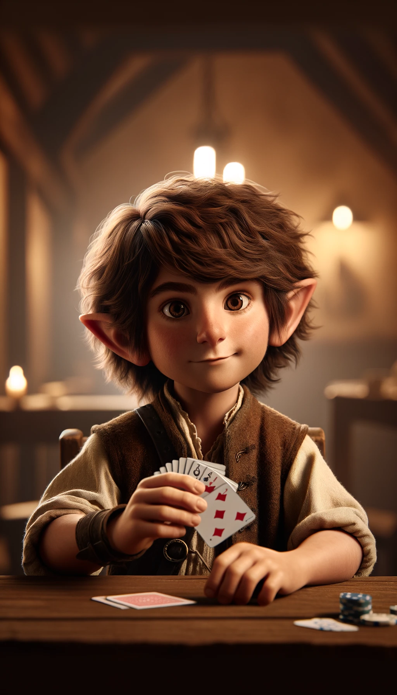
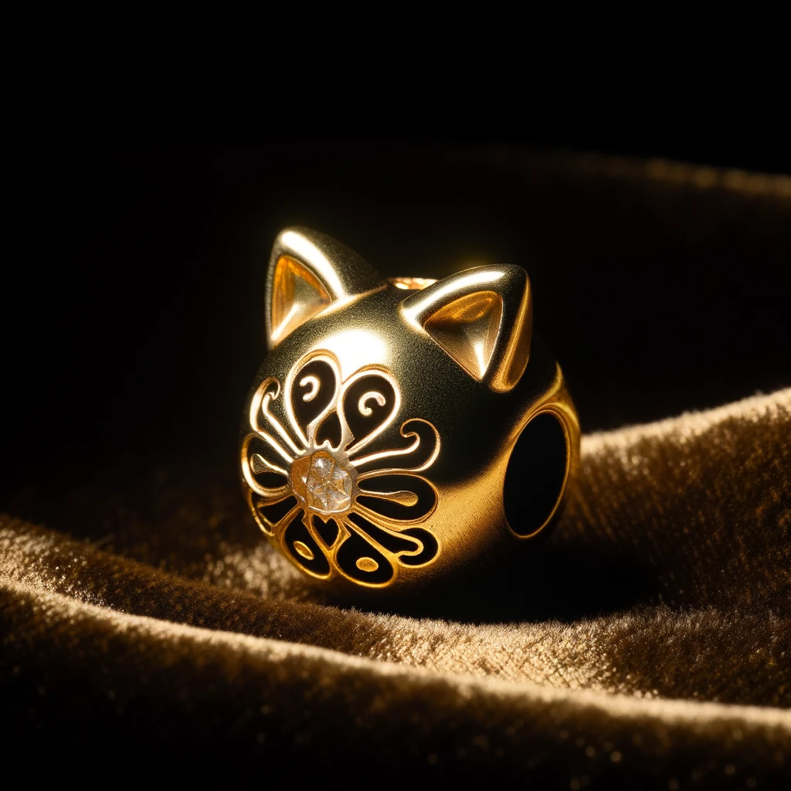
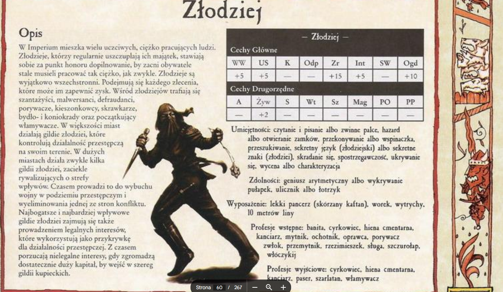
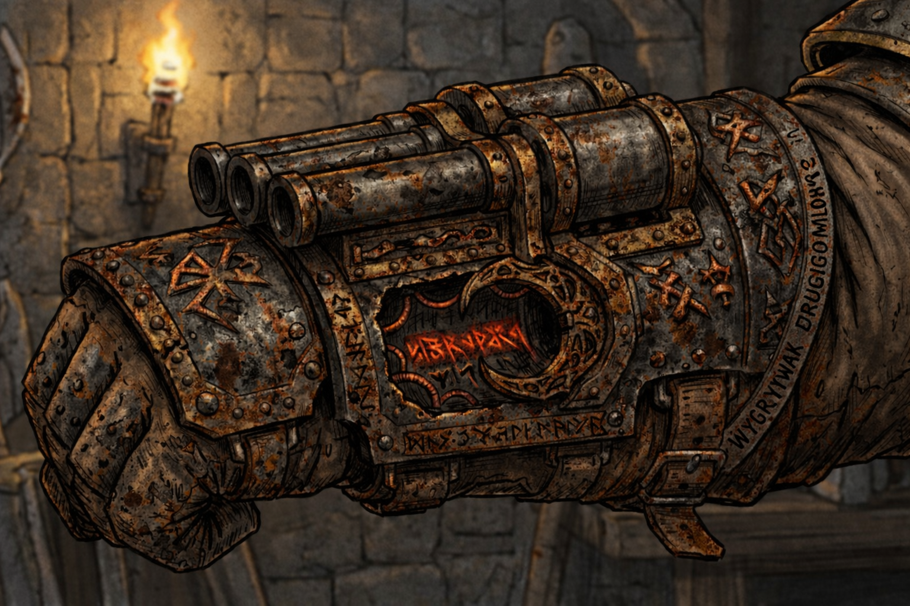

# Prolog



Gudd Gudo "Koralik" (niziolek) pochodzi z Krainy Zgromadzen - rodzimych ziem niziolkow.

Moja przepowiednia:

> Strzez sie zwierza z pol i czerwonej bestii

Ma 26 lat (19 w ludzkich), jest poczatkujacym szulerem. Aktualnie znajduje sie w przytulku swiatyni Szaliji w Szarych Gorach - dokladnie Reinsfled (bardzo daleko od Krainy Zgromadzen (6 miesiecy z buta)) - gdzie opiekuje sie nami kaplanka - siostra Eliza - ciepla i opiekuncza kobieta - jej dlonie o kojacym dotyku zdolnym leczyc najciezsze rany fizyczne i psychiczne; oraz Cadfelt - czlowiek ktory wydaje sie jest stary od zawsze - zawsze siwe wlosy, zawsze przygarbione plecy, zawsze zmarszczki na twarzy.

Inni gracze:

- Joseph Muller (Krisu) (sluga) (czlowiek) (sluga w przytulku)
- Thet-An Naen (Janek) (bajarz) (elf) (chlopiec w przytulku - brat Lin'a)
- Mor'Ol'Lin (Kuba) (podrzegacz) (elf) (chlopiec w przytulku - brat Naen'a)
- Eastern Riorn (Maciek) (cyrkowiec) (elf) (chlopiec z karczmy)

Cecha fizyczna: Wszystkie wlosy sie kreca
Cecha psychiczna: Dziecinny

Moj przedmiot - zloty zeton w ksztalcie koralika z kocimi uszami



# Sesja 1 - 29.03.2024

W Reinsfled zycie toczy sie wlasnym rytmem. Nikt tu za bardzo nie przyjezdza, nikt nie odjezdza, wszystko jest statyczne.

W ogrodzie kolo karczmy siedzi dwoch braci elfow (Naen i Lin). Kloca sie jak to bracia. Naen tworzy wysmiewcze rymy o Lin-ie kiedy ten grzebie patykiem w ziemi tworzac projekt ulotek politycznych.

Cadflet, ich opiekun, przychodzi zdenerowwany - "Dlaczego sie nie zajmujecie pieleniem moich poletek ziol leczniczych?" i zabiera im pioro i patyk i zagania do roboty.

---

Joseph siedzi na rynku, nic sie nie dzieje wiec oddaje sie swojemu ulubionemu zajeciu - malowaniu. Maluje swoja cele w ktorej dawien dawna siedzial. Do Josepha podchodzi kaplanka Eliza. Prosi go o pomoc azaliz onegdaj na jutro.

---

Riorn jest w karczmie razem ze mna. Ja siedze sobie i pokazuje Riornowi sztuczke karciana. Probuje go namowic na zaklad za szylinga ale odmawia. Wtem przychodzi do mnie wysoki (2 metrowy) zakapturzony mezczyzna i proponuje partie pokera. Wejscie 1zk a ja stawiam swoje kosci (z kosci). Widze ze mezczyzna uklada karty ale ja jestem w stanie je mniej wiecej policzyc.

---

Josephowi malowanie zostaje przerwane przez Naen'a. Naen probuje dowiedziec sie co Joseph maluje ale nie wychodzi mu - bardziej obraza Josepha niz okazuje mu respekt.

Lin poszedl szukac brata ktory nagle zniknal z zadania zbierania ziol na poletkach Cadfelta. Naen i Joseph widza Lina nadchodzacego ze strony ryneczku wiec rozchodza sie mowiac ze spotkaja sie w karczmie.

---

W karczmie - Riorn krzyczy na Naen'a zeby nie chodzil po mokrym. Naen wskakuje na stol upierdalajac go calego blotem. Lin to samo. Gram z nieznajomym i widze ze mam fula a on tylko pare. Mowi "Zaraza..." i odchodzi. Wygralem zloata korone :3

Naen probuje nieznajomego zaczepic ale tamten sie nie daje. Wchodzi lutniarz - gladki, dobrze ubrany, czysty. Naen go zaczepia (probuje pisac opowiesci na podstawie historii nieznajomych).

Wielki mezczyzna z dwoma mieczami siada przy innym stole, tam gdzie jest najbardziej pusto. Lutniarz siada obok niego i gadaja o swoich przygodach. Lutniarz jest zywy a wiedzmin wycofany.

---

Do karczmy zaczynaja sie zbierac ludziska. Miedzy innymi Torvald - czlowiek czynu a nie mowy, potem przychodzi Tobiarz - mlynarz, roztrzepaniec, zyczliwy.

Po jakims czasie przychodzi rodzina pszczelazy - Wheelowie - sa nizolkami (cala rodzina 7 osob).

Po jakims czasie przychodzi Armin - karczmienny stajenny. Urodzil sie z reka do zwierzat.

Ostatni wpada Gerard - wlasciciel destylarni w wiosce.

Wioskowe panienki i panny tez przyszly i duza czesc z nich zaczela sie interesowac Jaskierem (lutniarz).

---

Jaskier dostaje od Nean'a kartke z jego tekstem - jest zachwycony ale jednak ma pare uwag do tego tekstu ktory dostal.

Ze strony panien slychac ochy i achy "Nean idzie do tego przystojniaka, po co, dlaczego? Ahhhh..."

Jaskier pochwala Nean'a i w trakcie pochwalania go zaczyna grac na lutni i idzie na srodek karczmy. Nean nie moze sie nacieszyc tym ze zostal pochwalony - begnie do brata ale tamten bardziej skupia sie na tym ze tne trzesie kartka niz trescia tekstu.

Przeciskam sie miedzy sukniami panien zeby cos zobaczyc. Pryscilla (ma mleczary cysterny) (podobam jej sie ale jeszcze nie az tak mocno ale jestem blisko) widzi mnie i mizia po wloskach, ja ide dalej posrod dzungli sukien.

Jaskier zaczyna grac cos zwawszego. Priscilla lapie mnie za rece i tanczy ze mna. Jedyne co widze to jej biust ale jakos mi to nie przeszkadza ( ͡° ͜ʖ ͡°).

---

Wiedzmin i Naen siedza naprzeciwko siebie. Naen patrzy na niego wpatrzony jak w statutke a wiedzmin siedzi i medytuje. Joseph rysuje wiedzmaka zza szynkwasu.

Tanczac z Priscilla probuje jej zaimponowac i ja jednoczesnie zaczepic wrzucajac jej wygrana zlota korone w biust. Korona upadla i wiedzmin ja podniosl.

Pobieglem do wiedzmina i pogralem dlugo z wiedzminem, finalnie nie udalo mi sie odzyskac mojej korony - wyszedlem na zero.

---

Joseph wychodzi z karczmy. Musial wyjsc wczesnie bo jutro od samego rana musi pomoc Elizie.

Priscilla mnie wychacza i idziemy na dlugi spacer. Rozmawiamy o tym co bylo co jest i co bedzie - o jej marzeniach i lepiej sie poznajemy. Odprowadzam ja do domu i kieruje sie do przytulku kolo swiatyni Szaliji.

---

Poszlismy spac - jest gleboka noc, delikatnie pada deszczyk. Kazdemu z nas cos sie sni:

- Rior ma sny przemarszu wojsk
- Naen o ludziach wyciaganych z chat
- Lin sni o tlumach ludzi, ognisku i namiotach
- A mi snia sie dwa wielkie namioty nad jeziorem a w jeziorze kapiaca sie kobiete

---

Budzimy sie wszyscy rano. Naen przechodzac po przytulku widzi jakie kartki a notatkami cyrulicznymi Cadfelta i idzie w strone jego sypialni. Naen widzi ze sypialnia Cadfelta jest pusta a wszystkie szafki sa pootwierane a ich zawartosc przeszukana.

Lin w kuchni widzi taki sam rozpierdol jak Naen w sypialni Cadfelta. Naen biegnie do miasteczka a Lin przeszukuje reszte domu. Lin wchodzi do pracowni i widzi ze ksiegi zakazane leza porozrzucane na podlodze. Zauwaza tez ruszajaca sie deske - usuwa ja z drogi - patrzy a tam peleryna cala czarna z jakimis oznakowaniami.

---

Naen budzi Riorna i prosi go zeby obudzil wiedzmina - "Okradli nas!". Wiedzmin obudzony widac ze ma oczy z pionowymi zrenicami.

Riorn budzi Henryka i mowi mu o tym ze cyrulik Cadfelt zostal okradziony. Tamten odrazu organizuje zbiorke w wiosce zeby zalatwic 40 zk dla wiedzmina zeby zaczal sledztwo.

Lin slyszy krzyki swojego brata z ogrodu. Nean drze pizde bo krzaczki zostaly podjebane.

---

Eliza mnie budzi i mowi ze Joseph dostal poranne zadania a ja mam dzisiaj umyc podlogi w swiatyni i jak skoncze to reszta dnia jest moja. Mije te podlogi, widze Urala (starca co ma "milion lat"). Rozmawiam z nim dzien jakos mija...

---

Wiedzmin z Riorn'em ida na miejsce zbrodni. Wiedzmin pokazuje Riorn'owi co gdzie i jak - Riorn chuja rozumie. Wiedzmin znajduje tajemne przejscie w pracowni Cadfelta wraz ze skrzynia i tajemniczymi, ciemnymi szatami. Nie wiemy co moge oznaczac.

---

Ja koncze swoja prace w swiatyni, dostaje od Elizy pare szylingow za dobra prace i udaje sie do karczmy. Tam opierdalam paczka z kaszanka i zurawina - smakuje mi niesamowicie - bedzie nowa pozycja w menu. Henryk mowi mi co sie stalo w przytulku - biegne tam ogarnac co sie dzieje.

Riorn tlumaczy mi co sie odiwanilo - slyszymy gonca na moscie. Mowi ze za pare dni przez nasza wioske bedzie przejezdzalo wojsko imperialne.

Po 10 minutach widzimy ze wiedzmin wraca z Naen'em i Lin'em. Pyta sie nas o jakies niezwykle rzeczy lub cos nienormalnego. Bez slowa podchodzi do skraju lasu i przypatruje sie ziemi. Zadaje pytania o Cadfelta - mowi ze wyglada jakby ktos go porwal. Mozliwe ze jego przeszlosc go dogonila.

Wiedzmina bierze nas w las - prowadzi nas za szlakiem Cadfelta. Nagle zatrzymuje sie przy jakims kamieniu, rusza dziwnie rekoma i kamien sie zaczyna swiecic. Pyta czy gdzies tutaj nie ma miejsca gdzie ktos moglby sie ukryc - Naen i Lin pamietaja ze niedaleko jest jaskinia. Idziemy tam. Wchodzac do jaskinii widzimy ze ktos tam zrobil prowizoryczne schornisko z desek wraz z drzwiami. Jest dziwnie ciemno i zimny dreszcze przechodzi nas po karkach...

Podbiega do nas Rufus - pies Naen'a. Wiedzmin odrazu go ucisza i karze nam byc cicho wyjmujac srebrny miecz. Widac dym z jaskini. Wiedzmin probuje delikatnie otworzyc drzwi. Bardzo powoli nimi buja w taki sposob zeby nie zakrzypialy.

# Sesja 2 - 15.07.2024

(Rozwoj 2 + 1 darmowe)

Wiedzmin (Raven) skrada sie do drzwi - przysluchuje sie, delikatnie otwiera drzwi. Wyciagamy bron i udajemy sie za Ravenem do srodka jaskini. Czujemy chlodne i wilgotne powietrze, sciany pokryte delikatna warstwa sluzu, daja efekt jakby oddychaly. Krople wody nie pozwalaja sie w 100% skupic.

Raven zatrzymuje sie po paru krokach, wyjmuje z plecaka fiolke ze srebrnym, mieniacym sie plynem. Zauwazam ze sciany sa pokryte porostami ktore oddaja swiatlo - kolory zmieniaja sie z zielonego na fiolet na czerwien i spowrotem.

Idziemy w glab i jest coraz wiecej sluzu, porostow. Pod nogami coraz wiecej lisci i kosci malych zwierzat. Korytarz otwiera sie na przestronna sale, tak duza ze nie widac sufitu.

Widac na srodku drwieniany stol z resztkami krwii, wokol kadzidla i swiece. Kadzidla pachna ziolami opiekuna Naen'a i Lin'a (Catfeld). Za stolem znajduja sie okragle, ogromne, kamienne drzwi.

Joseph slyszy Cadfelta jak gada z kims za tymi drzwiami, rozmawia z kims. Nieznany glos grozi Cadfeltowi. Wtedy Raven otwiera kamienna drzwi aby uratowac Cadfelta.

W srodku jest 4 mezczyzn i Cadfelt. Raven wchodzi tam na pelnej kurwie gotowy do walki, Joseph patrzy zza framugi, my rowniez. Szata jednego z mezczyzn nie odbija swiatla, jego skor pokryta jest tatuazami, a mezczyzna jest widocznie starszy od reszty.

Wtem Naen wychodzi wraz z Lin'em gadajac cos o tym ze sa grupa cyrkowcow. Dziad stoi w miejscu, Raven probuje sie skradac ale mu sie nie udaje (jakby stal w miejscu). Adepci ida w nasza strone.

Riorn rzuca nozem i trafia starucha w ramie. Ja strzelam mu z procy, on sie do mnie usmiecha i teleportuje sie za mnie.
Adpeci zaczynaja sie miedzy soba klocic (roll na 100 na inteligencje).

Magowie sa adeptami kolegium cienia - palaja sie w iluzjach.

---

Wojt wioski oglasza za za dwa dni przyjada wojska imperialne i trzeba przygotowac wioske pod to. WOjt rozdaje nam zadania:

- Riorn: pomoc przy ognisku
- Naen: pomoc przy ognisku
- Lin: ulotki rekrutacyjne
- Joseph: pomaganie w swiatyni
- Gudd'o: pomaganie w swiatyni

Lin tworzy idealne ulotki, bardzo szybko.
Joseph i ja pomagamy w swiatyni. Lozka wyjebaly sie na mnie (stracilem 2 hp). Joseph mi pomaga (bedzie tam sypialnia dla zolnierzy).
Naen i Riorn przygotowywuja ognisko - niosac drewno, Riorn stracil koncentracje i zaczal biec za zwierzyna (teraz bedzie wielki lowca od czasu kiedy kupil luk).

Ostatniego dnia przygotowan na przybycie wojska, podczas popoludniowej modlitwy w swiatyni, poczulem obecnosc, takie dziwne cieplo. Mam wrazenie ze na dloni cos mnie przypieklo. Pojawil sie gleboki slad jakby ktos mi cos wypalil a potem to cos zniknelo - na prawej rece. Byla to pieczec bialej golebicy - znak Szaliji.

```IMPORTANT
Eliza tlumaczy podstawy wyznawcow Szaliji:

- nie zabijaj
- nigdy nie odmawiaj pomocy potrzebujacemu
- nie zatrzymuj duszy jezeli nadejdzie jej czas odejscia w zaswiaty
- krocz przez zycie bez bronim potrzebny ci tylko podrozny kij
- zwalczaj Nurgla, wladce much we wszystkich jego postaciach i wszystkie jego slugi

To moment zwrotny mojej postaci, powinienem probowac zostac akolita/kaplanem aby spotegowac pomoce Szaliji w dalszych podrozach.

Wieczorem, juz w lozkach w swiatyni, Joseph opowiada nam swoja historie, Pokazuje nam dwa obrazy (gory w nocy i czerwony korpus). Opowiada jak zostal sprzedany jakiemus krolowi i jego sadystycznej corce. Uratowala go rodzina szlachcickich elfow i od tamtego czasu pracuje w swiatyni ze mna i Eliza.
```

Dzien przyjazdu wojska.

Z rana slyszymy wiele krokow. Naen chodzi z woda i proponuje picie ale zmeczeni zolnierze go ignoruja. Lin poznal oficera i pokazuje mu ulotki zachecajace na przylaczenie sie do szeregow. Joseph i ja pomagamy w swiatyni - ja tez modle sie zeby uzyskac pomoc od Szaliji, gdzie mam sie kierowac w zyciu z laska i spojrzeniem.

W swiatynie zorganizowane zostaje pomieszczenie oficerskie, zolnierze jedza i pija, odpoczywaja. Nadchodzi wieczor, czas ogniska. Naen rabie drewno a Riorn caly czas szuka zwierzyny do lowienia. Lin przychodzi i zaczynaja razem rabac drewno na ognisko.

Naen rozpala ognisko a Lin przemawia do ludzi zeby zebrac ich na ognisko. Zolnierze zbieraja sie z miesem i trunkiem wokol ogniska. Naen naciera twarz weglem i opowiada opowiesc o dzikosci. Opowiesc o dwoch braciach - Naen'ie i Mor'Lin'ie. Opowiada to co stalo sie cztery dni temu z Raven'em, cyrulikiem Cadfeld'em, oraz cala reszta nas. Opowiesc porawala tlumy - wszyscy stoja i bija brawo. Jaskier i Raven rownierz bija brawo jednakze prosza Naen'a aby nie opowiadal tej opowiesci zbyt czesto.

Po wieczorze pelnym emocji, kladziemy sie spac u Cadfeld'a.

---

Budzimy sie rano, a moze nie rano? Jest bardzo jasno. Wtem jeden zolnierz wbiega do domu Cadfeld'a - z buta wybija drzwi z framugi. Zolnierze wyciagaja dzieci z domow. Budzimy Cadfeld'a. Pokazujemy pomoc przy ogniskum i plonace pochodnie na zewnatrz. Jeden z zolnierzy dobiega do Lin'a i mowi "O, TY BEDZIESZ KOLEJNY! TY SIE NADASZ!".

# Sesja 3 - 26.07.2024

Zolnierz stoi w drzwiach. Wchodzi do srodka. Lin i Naen budza nas, widzimy ze nie ma nigdzie Riorn'a. Joseph i ja ubieramy sie szybko. Naen wywala z domu zolnierza i zamyka drzwi. Zolnierz sie poddaje.

Widzimy jak zolnierze w calej wiosce zbieraja mlodych mezczyzn i mlode kobiety na glowny plac. Cadfelt barykaduje drzwi i kaze nam uciekac.

Wypadamy przez tylne drzwi, slyszymy jak zolnierze za nami pytaja Cadfelta gdzie jestesmy. Spierdalamy do lasu na polnoc - chcemy pobiec do swiatyni. Widzimy oka mgnieniem ze Cadfelt lezy na podlodze i cos szepcze i rusza dlonmi.

Skradamy sie po lini lasu do swiatyni, wtem napotykamy Ravena i Leanarda (lowca i bajarz). Mowia nam ze nie mozemy uciekac przez las, trzeba isc przez rzeke i przejsc przez most.

Kierujemy sie do swiatyni - wielu ludzi ze swiatyni zostaje wyciagnietych przez zolnierzy. Uderza Elize ale nie mozemy jej pomoc narazie - Szalija tez mnie nie slyszy. Joseph probuje zwrocic uwage zolnierzy rzucajac kamieniami ale nic nie dziala. Raven i reszta sie oddalaja ale nie biegniemy za nimi zeby sie nie wypierdolic.

Dochodzimy do mostu, 20 zolnierzy stoi odwrocne plecami jakies 200 metrow od mostu. Przechodzimy przez most i dochodzimy do mlyna ktorego wlascicielem jest Tobiarz. Mlyn jest otwarty ale drzwi sa zamkniete. Podbiegam do drzwi i otwieram je powoli widze niziolke (okragla, w mundurze za duzy z fafluniscie podpietymi oznakami i emblematami, ciemnobrazowe, duze oczy, rude wlosy, przestraszona, zastyga w bezruchu).

Nizolka schowala sie za filarem, na srodku jest jedna pochodnia. Lin wkurzony, wbija z kopem do mlyna. Niziolka nadal chowa sie za filarem.
Joseph mowi niziolce "Te z rudymi wlosami wychodz!" i wyciaga miecz. Klocimy sie miedzy soba zeby nie przestraszyc nizolki kiedy Lin i Jospeh sa nastawieni agresywnie do ubranej w mundur nizolki.

Tobiarz wchodzi do mlyna w pizamie, niziolka nadal sie chowa a Jospeh nadal ma wyciagniety miecz. Jest skonfundowany, tlumaczymy mu co sie dzieje w wiosce. Tobiarz widzi ja pierwszy raz.

Ona ltumaczy ze dostala oferte nie do domowienia. Wojsko ja wzielo ale udalo jej sie uciec w naszej wiosce. Jej oferta nie do odmowienia byly grozby mieczem.

Tobiarz sciagnal Lin'a na bok i mowi mu ze jest tunel do tajnej kryjowki Cadfelta ktorym mozemy uciec i tam bedziemy bezpieczni.

Wchodzimy do tunelu ktory tobiarz wraz z linem otworzyli. idziemy i na koncu kraty.

## Nowa postac - **Murc-Lotta "Podplomyk"**

**Murc-Lotta "Podplomyk"** - nasza nowa niziolka. Jej potrzeba i marzeniem jest wrocic do rodzimej wioski. Jest cyrulikiem. Jest urokliwa. Chcialoby sie powiedziec ze jest ladniejsza od 50% spoleczenstwa. Widac ze mowi prawde bo widac charakterytyczne szramy na jej rekach. Jest dentystka - poszla w slady ojca i prowadzila jego klinike w wiosce.

Joseph pierdoli... - nadal nie ufa Murc-Lott'cie.

Idziemy jaskinia i widzimy wyjscie. Wychodzimy, widac pagorek a na nim wieze, lekko podniszczona. Wyglada jak stara wieza graniczna. Ide w jej strone. Reszta za mna. Dochodzimy do wiezy. Spokoj, cicha, delikatny wiaterek a ptaszki spiewaja. Drzwi wiezy sa drewniane, jest zimno ale nie nieprzyjemnie. Ciemno, kamienne schody, cale, pna sie ku gorze.

Gdzie niegdzie zapasy ale wiekszosc zgnila, stare meble i w rogu zeliwny garnuszek. Wraz z Lott'a bierzemy sie z przejzenie wekow i kiedy Naen da sygnal ze mozna rozpalic ognisko to przyzadzimy jakas strawe.

Joseph i Lin poszli na 1 pietro - widza tam torby, stol alchemiczny i suchy prowiant. Na stole jest ksiega, Joseph czyta ze to ksiega o zielarstwie. Probuja ja podniesc ale nie sa w stanie - chyba jest przytwierdzona.

Na 2 pietrze Naen widzi plachty, dywany i wychodzacy na zewnatrz balkon oraz drzwi.

Na 3 pietrze (dach) Naen widzi okolice. Wielka polana, na granicy drzew zwierzeta. Zza linii drzew widzi zabudowania - mozliwe ze to nasza wioska Reinsfield. Nie widac zadnych innych zabudowan ani zadnych ludzi ani dymu.

Nagle slychac rozbijane fiolki na 1 pietrze, to Lin sfrustrowany musial sie wyrzyc. Rozmawiaja jak brat z bratem.

Tymczasem Joseph sprawdzal pokoje na gorze a Ja i Lotta poszlismy zbierac drewno ale ze jestesmy debilami (jezeli chodzi o przetrwanie) to udaje nam sie tylko zebrac lekko mokre galezie i runo lesne. Lotta znajduje pudeleczko pelne zapalek i mozemy go uzyc do rozpalenia ognia. Ogien niesetyt tylko sie tli dlatego wychodze na zewnatrz w celu scieca mieczem jakichs mniejszych drzew.

Lotta zaczyna gotowa a ja dokladam drewna. Gulasz z serem i sucharkami jest pyszny, syty i nawet Josephowi uszy sie trzesa.

Joseph zamkna sie w pokoju i zaczal malowac krwia ale zadne z nas tego nie wie.

My po dwoch miskach gulaszu poszlismy spac jeszcze w trakcie jedzenia.

---

Budzimy sie wieczorem tego samego dnia. Joseph zszedl do nas. Teraz powoli zaczyna nas uderzac ze jestesmy pierwszy raz sami bez niczyjej opieki

Po dluzszej naradzie dochodzimy do wniosku ze wracamy do Tobiasza tunelem - zabierajac prowiant, ksiege z czytelnika (brakuje jej tylnej okladki bo ja wyrwalismy). Idziemy i nagle daleko w lesie slyszymy dzwieki wilkow lub psow. Szybko pakujemy sie do otworu tunelu.

W srodku ciemno i zimno tak jak wczesniej. Dochodzimy do drewnianego sufitu. Poprzez drewniane deski klapy slyszymy wachanie psa. Z mysla ze to pies Tobiasza, Lalek, Joseph wola go i slyszy piski i drapanie w klape. Joseph otwiera klape wraz z Lin'em. Wychylamy glowy przez drzwii i widzimy w glab wioski gdzie widac znacznie mniej namiotow wojska. Widac troche psow i swiatlo w domu Tobiasza.

Nean sie skrada do domu Tobiasza.

Slyszymy ze ktos sie skrada w naszym kierunku, ale ledwo co to slychac. Czaimy sie w mlynie i rzucamy sie na intruza. To Naen.

Mowi ze nasza ucieczka byla glosna sprawa i zostaly dwa pulki zolnierzy zeby nas szukac. Musimy stad uciekac jak najszybciej mozemy. Eliza i Cadfelt sa cali. Tobiasz powiedzial ze musimy uciekac wraz z nurtem rzeki az do rozwidlenia.

Idziemy wzdluz rzeki, slyszymy raz co raz zwierzeta. Nagle slyszymy dzwieki kopyt. Chowamy sie w chaszczach. Kopyta zaczynaja galopowac w nasza strone. To Bestigory! Pol kozy pol ludzie (troche jak minotaury ale to kozy).

Probujemy uciec od bestigor ale zmuszeni jestesmy do walki. Joseph wali z miecza ja z procy ale nic to nie daje. Jedna z bestigor wpieprza sie w rzeke probujac mnie nadziac na swoje rogi ale udaje mi sie uniknac. Lotta ucieka a Lin wali w bestigore ale nic to nie daje, bestia jest za mocna. Probuje temu w rzece skoczyc na plecy ale sie nie udaje - odrazu jak na niego wskoczylem to mnie zrzucil do rzeki. W odwecie probuje mnie nadziac na rogi jeszcze raz ale znowu mu sie nie udaje. Joseph, Naen i Lin walcza z poprzednim bestigorem. Joseph zamachnal sie mieczem nie trafil ale jak nim wracal zamachanl sie pod pache bestigora i odcial mu reke. Bestia drze sie w nieboglosy. Atakuje drugiego bestigora wrecz ale uderzam w udo. Ten zamacha sie we mnie mieczem ale przelatuje nad moja glowa. W koncu jednak mu sie udaje, dostaje w glowe za 5 pktow. Naen trafia bestie poteznie i sprawia ze teraz na nim sie skupia. Joseph trafia w noge bestii i sprawia ze sie topi w rzece. Obie bestigory pokonane.

Szlismy cala noc w kierunku nurtu rzeki. Jestesmy padnieci, we krwii, mokrzy. Polozylismy sie posrodku lasu, przy ognisku ktore Joseph rozpalil przy uzyciu swojego krzesiwa i oleju.

# Sesja 4 - 12.04.2025

---

## Podsumowanie tego co bylo do tej pory

Wydarzenia przez ktore przeszlismy zostawily na nas pietno, Katwelt (nasz opiekun) zniknac. Raven i Gerard pomagali na, znalezlismy Kadfelta zlapanego przez kultystow (idac tropem jego ukrytej pracowni). Przygotowalismy sie do przybytu wojsk cesarskich. W nocy miala miejsce oblawa. W jej trakcie Raven szukal sladow po Kadfelcie. Znalazl szate podobna do szat kultystow z przekreslonym znakiem kultystow. Po tym poszlismy do mlyna Tobiasza (poza wioska). Tam spotkalismy Mucr-Lotte (nizolnica pracujaca dla wosjk). Poszlismy w kierunku wirzy regionalnej, tam sie schowalismy i odpoczelismy. Po odpoczynku wrocilismy do wioski, zeby sprawdzic co sie dzieje. W wiosce brak jakichkolwiek mezczyzn i chlopcow. Tobiasz namowil nas zebysmy uciekali wraz z nuretm rzeki, do rozwidlenia. Tam znajdziemy pomoc. Po drodze zaatakowaly na bestigory.

---

Naen - Janek
Isternriorn (Rion) - Macius
Mororlin (Morlin) - Kubus
Joseph - Krisu
Plomyk - ex Janka (aktualnie Czarek)

---

Jestesmy miedzy Wurstbad (na polnac 60km) a kapliczka Szaliji (okolo 2km w lesie). Suszymy sie prz ognisku, jest ranek, pareset metrow od rzeki.

> Sen
> W trakcie snu, snila mi sie biala golebica lecaca w kierunku duzego bialego budynku. Nagle bialy budynek zaczal sie mienic niebieskim swiatlem, prawie jakby stanal w plomieniach a sam budynek obrosl mackami. Wtem biala golebica jakby wybuchla i plomienie wraz z mackami zniknely.

Slyszymy szczekanie psa, to pies Tobiasza. Z nimi idzie Raven (wiedzmak), Jaskier (trubadur) oraz Gerard (biombrownik). Informuja nas ze nasza ucieczka poniosla sie duzym echem. Jestesmy zdrajcami - w najlepszym przypadku trafimy do wojska, w najgorszym zostaniemy powieszeni.

Dostalismy pozywienie od Gererda (na 6 dni) 3 flaszki bimbru, zapalki, line (10 metrow), buklak na wode, siekiera.

Raven lapie mnie i Morlina i pokazuje nam cos w oddali - cos jakby sie mienilo. Raven mowi ze to jakas zbroja, mozliwe ze ida tam wojska, na poludniu.

Sprawdzam czy bimber jest latwopalny - JEST latwopalny - dobiegam do rezty i wyruszamy. W trakcie podrozy Gerard opowiada alkoholowe anegdoty. Raven nas prowadzi, co chwila sie rozglada, sprawdza las i droge, rozglada sie. Dochodzimy do rozwidlenia, skrecamy w prawo. Po paru godzinach marszu, nogi wchodza nam w dupe. Las zaczyna sie rozrzedzac. Polana otoczona starymi debami, na srodku kapliczka ze znakiem bialej golebicy (znak Szaliji). Zatrzymujemy sie w tej kapliczce idac za glosem Ravena. Sa tez tam inni ludzie, powietrze wypelnia zapach ziol i kwiatow. Niektorzy pracuja a niektorzy ci ktoryz nie moga, odpoczywaja lub rozmawiaja. Dzwonimy dzwonem do kapliczki.

Otwiera siostra Agata - kaplanka Szaliji, ciemne wlosy, zielone oczy, schludna szata, inne szaty niz siostra Eliza. (Critical Success) Zauwazam ze ma tatuaz, nie do rozpoznania. Zaczela mnie piec reka jak go zobaczylem. Widac ze chowa ten tatuaz.

Za oltarzem w kapliczce jest jeszcze druga siostra, bardzo stara, widac ze jest bliska smierci, modli sie, nie ma z nia kontaktu.

Modle sie w kaplicy kiedy reszta gada z ludzmi pracujacymi - wielko-cycata kaplanka dolacza sie do mnie ale nic z modlitwy sie nie udaje. Rozkojarzony z powodu dydow.

Nagle szlyszymy krzyk dzicka, jest rozpalone. Jak Agata doknela dzicka to pojawily sie na jego czole pod skora czarne kreski. Kreski maja zielonkawa barwe. Raven mowi ze widzial juz wczesniej takie spaczenie - spaczenie Nurgla. Cycata siostra to Inga. Mowi ze musimy sprawic zeby dziecko wyzdrowialo. Wpadla w apanike. Agata uspokaja wszyskich. Mowi ze zna odpowiedni rytulal oczyszczenia krwii do ktorego potrzeba kogos niewinnego.

Raven powiedzial ze cala sytuacja mi sie strasznie nie podoba i sie zmyl. Odchodzimy przegadywamy sprawe - ten rytulal krwii to scam (slowa Ravena). Agata przyszla i spytala sie czy bedziemy pomagac, powiedzialem ze "jak najbardziej pomoge". Reszta zostala, ja poszedlem z nia.

Agata pyta sie co to za silna moc ktora we mnie drzemie, ja sie ja pytam o jej tatuaz. Ona probuje cos zrobic, oczy mi zachodza jakby mgla ale potem nic sie nie dzieje. Pytam sie ja jeszcze raz o ten tatuaz, znowu nic, pytam sie ja czy nie chce sie jej srac. Potem probuje sie wyrwac. Wyrwalem sie i katem oka widze dwie postacie wychodzace z lasu w szatach tkore juz wczesniej widzialem, wokol Agaty zaczyna krecic sie wiatr a jej oczy swieca sie turkusowym blaskiem.

Probuje powiedziec chlopakom co sie stalo ale nagle slyszymy "ZAMKNIJ MORDE!!" to Agata. "Jak smiecie sie stawiac panu zmian Tzinchowi w jego swiatyni skurwysyny!"

## Walka 4.1

Kolejnosc:

- Agata
- Raven
- Jaskier
- Istern
- Naen
- Morlin
- Joseph
- Koralik (Ja)
- Kultysci

1. agata zwija niebieskie plomienie kierunku Josepha ktora go pochlaniaja. Jaskier spierdala. Raven biegnie sprintem w strone kultystow. Iskier stoi w miejscu. Naen, Morlin i ja sie chowamy. Kultysci przygotowywuja jakies modly.
2. Raven macha mieczem a Agate, trafia w lewe ramie i wyciaga. Krew leci wszedzie - zaplamia biala szate na niebiesko (co tu sie odpierdala?). Istern trafia strzalaw kultyste przerywajac ich rytulal. Naen biegnie po stara kaplanke. Morlin podbiega do Agaty przygotowywuje sie do szarzy. Joseph flankuje. Ja napierdalam z procy za 14 w drugiego kaplana. Pieczec rytualna sie zamknela. Kultysci patrza sie na siebie, machneli sobie glowami i jeden z nich zamienil sie w cien a drugi go jakby wchlonal. Joseph czuje jakby na nim cos roslo ale potem znika (nieudany rzut kultysty).
3. Agata zgniata kamien w dloni i wciaga go nosem (magiczny koks?). Momentalnie jej wszystkie wlosy zamieniaja sie w piora, cala staje sie czarna i wyrastaja jej skrzydla i zaczyna sie wspinac w powietrze. Raven poprostu sie na nia patrzy. Istern strzela w nia ale nie trafia. Agata odlatuje. Cos z niej wypada, to resztki ciuchow Agaty. Zaczynaja sie przciagac wraz z plecakiem Ravena. Raven atakuje Kultyste. Ucina mu leb. Josephn lapie za szmaty ktore spadly z Agaty i czuje ze cos pod nimi jest, wiec je zrywa z tego czegos. Widzi tam elementy kamienia z runami na nim.

Koniec walki

Naen wraca ze starsza kaplanka. Tlumaczy jej co sie tutaj stalo. Gadaja o rytuale krwii. Tlumaczymy jej o wszystkim, mowimy o Tzintchu, o Agacie i o tym ze walczylismy z kultystami. Nie jest zadowolona z faktu ze rozlalismy krew na swietej ziemi. Trzepniete baby...

Raven wyciaga artefekt ze swojego plecaka. Mowi ze Kadfelt chcial nam to przekazac. Artefaktem jest drugi kawalek kamienia z runami.

Raven opowiada o Seraphenie - starym przyjacielu Kadfelta. Kadfelt byl kiedys wyslannikiem szkoly magicznej cienia. Seraphen chcial uzyc tego kamienia cienia - pieczeci Szaliji - do sporzadzenia rytulalu ktory zamienialby ludzi w zmutowane gowna. Normalnie ta pieczec dziala odwrotnie ale Seraphin chcial uzyc odwroconego rytulalu zeby spowodowac odwrotne efekty.

Starsza kaplanka - Helga - podchodzi do nas i mowi ze rozumie ze musielismy zrobic to co zrobilismy. Pyta sie czy pomozemy jej oczyscic to miejsce z plugastwa. Zaczynamy sie modlic nad ta krwia spaczencow, stajemy sie lacznikami magii boskiej (ja, Naen i Morlin) - ci ktorym nie wszlo to odeszli. Ja widzialem ta magie wczesniej ale teraz wiem co to jest i widze takie bialy dym unoszacy sie od wszystkich. Wpadamy w delikatny trans. Czujemy narastajace cieplo i emocje takie jak szczecie, spokoj, jakbysmy byli otuleni zajebistym kocykiem. Pojawia sie dodatkowy cien za kaplankami i za mna w ksztalcie ptaka. Nagle niektore kropelki krwii zaczynaja sie unosic i znikac. To samo dzieje sie z czesciami ciala. Nagle pojawil sie bialy plomien i wszystkie ciala spaczencow zniknely w bialym plomieniu nie pozostawiajac po sobie zadnych sladow.

Helga mowi mi ze powinienem zostac kaplanem, powinienem udac sie do swiatyni i probowac zostac akolita. W Grossfurre znajduje sie wieksza kaplica wyslannikow Szaliji. Raven poszedl do kapliczki odpoczac po walce.

Podejmujemy decyzje ze idziemy do Grossfurre do klasztoru Szaliji.

---

Zdobyte XP: 210

---

# Sesja 4 - 18.05.2025

Zostajemy wyekwipowani przez Gerarda, idziemy szlakiem uzywanym przez lowcow - nadal musimy unikac armii. Do Grossfurre jest ok. 600km (3 - 4 tygodnie drogi).

Mororlin (postac Kuby) dostaje od Ravena zestaw znakow uzywanych przez lowcow. Dzieki nim bedziemy w stanie podazac za szlakiem. Morlin niestety jest debilem i nie jest w stanie nauczyc sie tych znakow. Raven probuje nauczyc Josepha i mu sie udaje - Joseph bedzie naszym przewodnikiem po szlakach lowcow.

Obie sesje nauki trwaja lacznie caly dzien wiec nocujemy dodatkowa noc w swiatynii Szaliji. Helga proponuje nam cieply posilek.

Pytania i prosby do Helgi:

- Naen prosi o nauke lowienia ryb
- Rion nauczyl sie tropic zwierzyne
- Ja probuje sie modlic z Helga do Szaliji o blogoslawienstwo naszej wyprawy (nie wyszlo)
- Morlin nauczyl sie stawiania szalasow
- Joseph nauczyl sie podstaw leczenia

Naen zlowil 4 rybki, udalo mi sie 2 ryby przygotowac pod wyprawe.

## Podroz do Grossfurre - Dzien 1

Wyruszamy - Raven i Jaskier zostaja w swiatyni. Idziemy szlakiem lowieckim. Sciezka mimo ze jest uzywana przez ludzi to jest mocno zarosnieta. Cala sciezka daje sie zdawac objeta jakims magicznym czarem - jestciemno, gdzie niegdzie widac tylko przebijajace sie promienie slonca.

Po paru godzinach marszu zauwazamy mezczyzne ktory siedzi pod drzewem. Wychudzony blady, w plaszczu, z lekka kolczuga i obok niego lezy zlamany sztylet. Ma niepokojacy wzrok. Nie wyglada jak zolnierz, bardziej jak straznik drog.

Podchodze do typa, ten wnet lapie mnie za ramiona, oczy szalone, mowi "NIE RUSZAJCIE SIE, ONO WIDZI RUCH, DRZWEO ZNA WASZE IMIE, ODDALES ICH, NIE ZAPLACILES, TERAZ TWOJA KOLEJ TERAZ TWOJA KOLEJ (...)"
Typ kurczowo trzyma cos w rekach, czulem to samo kiedy spotkalem Agate (demonice w kaplicce Szaliji).

Wyrywamy mu to cos z lap - to kawalek pieczeci Szaliji ale nie taki jak reszta. Ktos dodal do tego dodatkowe czarne runy.

Straznikowi opada glowa - zemdlal. Rion zlapal kamien, wykrecilo go ostro, potem rzucil kamien i wrocil do siebie. Jak podniosl kamien to slyszal szepty.

Probuje zlaczyc ze soba jasny i ciemny kamien ale nie chca sie ze soba polaczyc mimo ze czarny kamien zaczyna sie swiecie na bialo. Dodatkowo kamienie wygladaja jakby mialy pasowac idealnie ze soba. Dotykam kamienia i moje rece zaczynaja oddawac jasne swiatlo a golebica widocznie swiecie mi sie na nadgarstku. Modle sie dlugo na tym kamieniem ale nic mi sie nie udaje.

Morlin bierze na plecy tego straznika z celem doniesienia go do jakiejs cywilizacji. Joseph znajduje na szyi straznika medalion gryfa na czarnym tle.

Joseph mowi - "jest to symbol szlachcica Heidelmana, sasiada naszej wsi, z zamkiem na wzgorzu" - pokazuje blizny na swoich plecach po czym sprwdza czy straznik ma te same blizny, ma je.

Joseph opowiada swoje backstory. Jak trafil na zamek Heidelmana, ze go mnisi sprzedali ze wzgledu na kolor jego oczu. Zostal tam zmuszony do sluzby (od 12 do 17 roku). W ucieczce pomogl mu elf - byl torturowany przez dwie corki i syna tamtego szlachcica.

Dochodzimy do serii gorek w lesie, zaczynamy sie zastanawiac nad rozlozeniem biwaku i nocowaniem.

Widzimy przed soba drzewo. Na nim wisza trupy, pod nim runy poukladane z kosci a posrodku czaszka kozla z wypalonymi oczami. Ewidentnie mial tu miejsce jakis rytulal.

Straznik nie zyje - Joseph idzie mu wykopac grob.

## Podroz do Grossfurre - Noc 1

W przygotowanym biwaku ide spac razem z Morlinem i Josephem. Naen i Rion stoja na warcie.

Snie mi sie nastepujacy sen:

"Staje wśród dzieci na modlitwie, ale ich twarze są zamazane. Kiedy zaczynają śpiewać, ich głosy zamieniają się w krakanie."

Nastepni na warcie sa Joseph i Morlin a spac ida Naen i Rion. Ja dalej spie.

## Podroz do Grossfurre - Dzien 2

Naen z rana lapie dwie ryby - daje mi je i przyzadzam je perfekcyjnie. Zwijamy biwak i idziemy dalej.

Po drodze widzimy dom, swiezo zgliszczony, pachnie krwia i strachem. Dom zostal zniszczony nie dawniej niz 2 tygodnie temu.

W piwnicy spalonego domu mieszka 13-sto letnia, problematyczna dziewczynke, ktora posiada medalion matki Nean'a i Morlin'a.

Dziweczynka mowi ze zdobyla medalion niedawno, pojawil sie na jej szyji po tym jka wojska przyszly do jej domu rekrutujac mezczyzn. Saplili dom, ona obudzila sie jakis czas potem z medalionem na szyi obok niej siedziala jakas postac, smukla, z blond wlosami. Od tamtego czasu slyszy jak popiol szepcze i widzi czarne jelenie ktore ja ignoruja. Nie pamieta swojego imienia. Prosi Naen'a o to zeby nadal jej imie. Naen nadaje jej imie Lirael (Lilly).

Lirael (Lilly) idzie z nami w podroz. Znajdujemy wejscie na szlak ale ze juz sie robi pozno wiec musimy znalezc miejsce na biwak. Brak nam wody.

## Podroz do Grossfurre - Noc 2

Przespana spokojnie

## Podroz do Grossfurre - Dzien 3

Spotykamy starego dziada co odpowiada na dowolne pytanie ale za nieznany koszt. Ja dostaje info ze dotyk uleczy te kamienie (odjeta umiejetnosc gotowania).

Joseph pyta sie co mu odebral szlachcic co go torturowal - godnosc (odjeta umiejetnosc jezyk staroswiatowy).

---

Zdobyte XP: 180

---

# Sesja 5 - 10.06.2025

---

Naen - Janek
Isternriorn (Rion) - Macius
Mororlin (Morlin) - Kubus
Joseph - Krisu
Loriel (Lilly) - dziewczyna ktora znalezlismy w opuszczonym spalonym domu

---

## Podroz do Grossfurre - Noc 3

Lirael, pograzona w polsnie, spiewa:

> Zabiora was znow tam
> Gdzie swiatlo nie siega
> Piec monet jedno imie
> Krew Dziecka
> Reka ksieza

Sni mi sie ze oddalem cala pieczec. Zostaje obsypany laurami - pelny mocy Szaliji i pewny siebie wychodze jako nowo mianowany kaplan przed swiatynie. Tam czeka na mnie bezdomna dziewczynka.
Szepcze mi do ucha "Mimo oddanego znaku i tak zguba jest pewna" - i wgryza sie w moja szyje.

## Podroz do Grossfurre - Dzien 4

Budze sie zmeczony (-5 do krzepy na ten dzien). Wyruszamy dalej w podroz. Joseph zaczyna pokazywac i wydawac dziwne dzwieki. Chyba pokazuje name ze znalazl tajny szlak tajnych lowcow.

Idziemy przez waski skrot, i wchodzimy na szeroki trakt.Na trakcie znajduje sie przwrocony powoz. Kolo reca sie powoli, ciala porozrzucane po drodze. Wygladaja jakby padlu silom chaosu - przypalona skora, twarze zamarzniete w strachu.

Rozgladam sie - pierwsze co zauwazam, to chlopak trzymajacy list z ksiazecej sluzby. Pieczec czarnego gryfa na zlotym tle. Joseph odrazu podbiega (nie rozumie co tam mowilem).

Rion mowi ze pojdzie w strone glosow i zagwizdze jak bedziemy mu potrzebni.

Morlin wytraca Josephowi bron ktora podniosl - myslac ze jest spaczona. Joseph bierze list z pieczecia.

W wozie znajdujemy: monete na awersie glowa bez twarzy a na rewersie znajduje sie trojoki ptak, sztylet z grawerem "H. H." - Naen i Morlin mysla ze to sztylet ich ojca (rozpoznali go jako takowy, wspomnienia, pewnosc 99%).

W liscie mowa o rytuale - H. (nieznane imie) dotknal naszych snow. Rytulal wymaga zgody a zgoda wymaga strachu. Tresc listu:

> Dar przekazany.
> Chłopiec gotowy dla Lady Marleny.
> Rytuał wymaga zgody, a zgoda wymaga strachu.
> H. czeka.
> Jego ręka już dotknęła ich snów.

---

Nagle slyszymy gwizd Riona. Potrzebuje nas!

Rion walczy ze zwierzoludzmi. Trafia jednego zwierzoludzia.

1. Rion trafia w zwierzoludzia lukiem i spierdala tak ze znajduje sie za mna.
2. Zwierzoludz probuje mnie zszarzowac ale nie udaje mu sie - zatrzymuje sie zaraz przy mnie.
3. Joseph napierdala na zwierzoludzia obok mnie, trafia ale nie robi mu wiele. wierzoludz sie wsciekl.
4. Morlin atakuje szalenczo na zweirzoludzia ktory stoi obok Naen'a.
5. Odsuwam sie od sowjego zwierzoludzia, nie trafia (opportunity attack), trafiam go w leb z procy.
6. Rion trafia mojego zwierzoludzia mocno w udo, tamten lapie sie za udo i pada. Zostae jeden.
7. Naen, napierdala swojego zwierzoludzia sztyletem.
8. Morlin, wkurzony, zamachuje sie mieczem i ucina mu leb, konczac walke.

Zauwazamy ze nie ma Lilly. Wolamy ja. Przychodzi, kiedy zapewniamy ja ze jest bezpiecznie. Widzimy ze jest cala umorusana blotem. Mowi ze sie troche przestraszyla.

Chwila spokoju. Joseph chce nam cos przekazac ale nie jestesmy w stanie rozszyfrowac o co mu chodzi.

Morlin znajduje w wozie fragment ksiegi rodu. Szczegolami sie nie podzielil jeszcze.

Joseph probuje sie uczyc naszych imion (na nowo) - udaje mu sie.

Morlin dzieli sie info o rodzie Heidelmana ktory juz wygasl. Zostal wykonczony przez Sigmara.

Znalezlismy rowniez wzmianke o rodzie Heidleman z pieczecia kruka w klatce. Tresc pergaminu mowi:

> Hiedelmanowie pochodza z krwii cesarskiej ale ich linia zostala zgaszona dekretami
> Sigmara a jednak wraca chodz pod innym imieniem.
> Szkarlatna szkola, Aldorf, klasztor zamkniety.
> Kontakt przez G.H.

---

## Podroz do Grossfurre - Noc 4

Idziemy dalej, mijamy opuszczona swiatynie Szaliji. Postanawiamy sie tutaj zatrzymac na noc. Widzimy w srodku swiatyni rozrysowane kreda 6 postaci przypominajacych nasza trupe - creepy. Modle sie o porade do Szaliji - porade dalszej drogi i co z tymi postaciami na scianie.

W trakie modlitwy dostaje wizja dziecinstwa - emocje - ktos mnie ukrywa przed pania w szkarlacie.

Widzimy w nocy pdaleko przed kapliczka mezczyzne w ciezkiej pelerynie. Trzyma dziecko za reke i odchodzi. Biegniemy za nim - ciagniemy za soba rowniez Lilly. Mezczyzna sie zatrzymuje. Lapie sie za medalion na szyi - fioletowy poblask. Wszystko zaczyna sie znieksztalcac. Drzewa zmieniaja pozycje a kroki brzmia echem.

Czujemy sie jakbysmy biegli w miejscu. W koncu dobiegamy do miejsca gdzie stal - widzimy tam tylko slad mezczyzny (tak jakby stal tam tylko i wyparowal). Efekt czaru niknie. Przerazeni decydujemy wrocic na noc do kapliczki i tworzymy prowizoryczne zasieki i barykady z galezi.

## Podroz do Grossfurre - Dzien 5

Budzimy sie rano i slyszymy beczenie owiec. Widzimy miasto przed kapliczka w dol doliny.

Morlin mowi ze dzienniku znalazl dodatkowa notatke o miescie Estoche - piszacy mowi tam ze musi zdarzyc tam ze swoim dzieckiem "inaczej wszystko stracone".

Podejmujemy decyzje ze warto sprawdzic ta sprawe, tym bardziej ze wydaje sie ona byc powiazana z nami lub, co bardziej prawdopodobne z ojcem Naen'a i Morlni'a.

Estoche to miasto portowe, pelne zapochow ryb w roznych postaciach. Swoja swietnosc widzialo juz dawno temu (vibe Gdanska)

Przy bramie brak straznikow. Ludzie nie sa usmiechnieci, w barach widac ze kufle sa oznaczone krwia. Samo miasto bylo kiedys dumna stolica kupcow ale teraz bardziej przypomina martwa rybe wyrzucana na brzeg niz tetniace zyciem miasto. W miescie znajduje sie rowniez zniszczony klasztor Szaliji. Postanawiamy isc prosto do portu - nie bedziemy w stanie tutaj zarobic bez przyciagania do siebie zbednej atencji.

W porcie szukamy tajemniczego zakapturzonego faceta z dzieckiem. Jeden z przechodniow mowi ze widzial podobnego jegomoscia kolo latarni.

Dochodzimy do latarni. Jest otwarta. Brak straznikow. Wchodzimy. W srodku znajdujemy ksiege ze szkicami dzieciecych twarzy, runami ktorych widok przyprawia o niepokoj a na ostatniej stronie kawalek dziwnej kolysanki. Jak patrzymy na te szkice dzieci to widzimy ze jedno z nich jest podobne do Josepha.

Pytamy sie Josepha czy kojarzy te dzieci - swoim uga-buga jezykiem odpowiada ze czesc dzieci kojarze ale reszty nie. Te dzieciaki byly slugami na tym samym dworze co Joseph kiedy trafil do niewoli.

Nic wiecej tutaj nie znajdziemy - wychodzimy pytac ludzi. Jeden z zaczepionych to zarzadca portu - mowi nam ze typek w pelerynie nie zdarzyl na statek i moze czekac w karczmie.

Wchodzimy do karczmy. Dosyc schludna. Rowniez tutaj na kuflach widac slady zaschnietej krwii. W karczmie za szynkwasem stoi potezna cycata baba - Gertruda. Naen idzie z nia gadac o niezajomym zapelerynionym jegomosciu. Pyta ja czy moze go zaprowadzic do pokoju w ktorym przebywal. W pokoju dwa lozka, pokoj na pierwszy rzut oka wydaje sie byc pusty.

Naen znajduje na scianie, przy mniej wygniecionym lozkiem (prawdopodobnie tutaj spalo dziecko), wyryte igla, tekst "Sa coraz blizej". Morlin znajduje strone z dziennika z narysowanym Josephem spiacym w skrzyni a nad skrzynia cienka linia krwii.

Gertruda pyta sie jak ma miec na imie jegomosc ale Heidelman to nie imie ktore posiada w dzienniku. W dzienniku widnieje Heidrich H. (Heidrich Heidelman).

Postanawiamy (po bardzo dlugiej namowie) ze bedziemy czekac na jegomoscia (Heidrich'a Heidelman'a) przed latarnia (3 w srodku, 2 na zewnatrz).

---

Zdobyte XP: 150
(aktualnie 970 + 150 = 1120)

---

# Sesja 6 - 20.09.2025

---

Gudo Koralik - Ja
Naen - Janek
Isternriorn (Riorn) - Macius
Mororlin (Morlin) - Kubus
Joseph - Krisu
Lirael (Lilly) - npc grany przez Czarka (dziewczynka ktora napotkalismy w zniszczonym domu)

---

Ja, Naen i Morlin jestesmy w srodku latarni a Lilly, Joseph i Riorn sa na zewnatrz.

Ja i Morlin chowamy sie za drzwiami, Naen czyta ksiegi nalezace do Hiedelmana. Joseph i Lilly czekaja niedaleko latarni a Riorn jest skitrany w krzaku obok latarni.

Naen szuka w skeigach czegos o genealogii Heidelmanow, dlaczego znikneli z kart historii albo czegos zwiazanego z Aldorfem. Niestety nie udaje mu sie. W ksiegach brak takich informacji. Ale znalazl wzmianke o katalizatorach rytulalow i tym ze dzieci sa idealne do tych celow.

Joseph widzi mezczyzne w plaszczu z dzieckiem przy boku - jakby bylo w polsnie - idacych alejka prowadzaca do latarnii. Postanawia go sledzic. Mezczyzna zauwaza ze Joseph go sledzi i obraca sie w jego strone, Joseph udaje ze nic sie nie dzieje i zskreca w inna uliczke ale nadal w kierunku latarnii.

Riorn z krzakow zauwaza mezczyzne w plaszczu. Zauwazyl tez akcje z Josephem. Po odejsciu Josepha mezczyzna stoi w tamtym miejscu jeszcze pare minut i po chwili rusza dalej. Riorn cierpliwie czeka w krzakach. Mezczyzna idzie dalej w kierunku latarnii.

Mezczyzna przechodzi kolo krzakow, przyglada sie framudze zamknietych drzwi latarni, Riorn wyskakuje z krzakow i wola do mezczyzny "Hej zatrzymaj sie!". Mezczyzna go ignoruje. Wychodzimy z latarni. Riorn lapie faceta za ramie i mowi "Poczekaj!". Mezczyzna ztrzepuje jego reke i dalej go ingoruje.

Naen rzuca sie szarza w nogi mezczyzny. Lapie go za nogi ale facet poprostu idzie dalej.

Riorn staje przed nim i mowi "Odpowiedz na nasze pytania!".

- Mezczyzna: "Ehhh, czego..."
- Riorn: "Co robisz z tymi dziecmi?"
- Mezczyzna: "Nie wasza sprawa"
- Naen: "Dlaczego oddajesz te dzieci lady Marlenie? To handle dziecmi, zawolamy straze i trafisz do ciupy!"
- Mezczyzna: "To wolajcie..."

Joseph zauwaza kto to i wyciaga miecz (to maz Lady Marleny, Baron, - tam Josepha na zamku chlostali i traktowali jak niewolnika, jest zrodlem calego zla ktore spotkalo Josepha w mlodosci).

Joseph grozi mezczyznie, mowi ze zabije jego corki (one tez go chlostaly), mezczyzna smieje sie mu w twarz. Joseph przygotowuje sie do ataku. Kaze mu puscic dziecko.

Mezczyzna cos szepcze. Wyciagnelismy swoje oraza. Naen, Riorn i Ja walczymy z iluzja mezczyzny. Joseph i Morlin biegan za prawdziwym mezczyzna. Strzelam w iluzje i trafiam w Josepha, prawie go zabijajac. Naen napierdala sztyletem w udo iluzji (w powietrze).

Joseph (ranny) i Morlin nadal biegna za prawdziwym mezczyzna. My nadal walczymy z jego iluzja.

Joseph i Morlin biegna pelnym sprintem za mezczyzna. Mezczyzna ucieka i w pewnym momencie zatrzymuje sie, odklada dziecko na ziemie i wciaga miecz. Morlin szarzuje na dziecko, lapiac je i spierdala dalej, mezczyzna nie trafia w niego mieczem. Wyciaga sztylet i przygotowuje sie do rzutu. Morlin przyspiesza. Mezczyzna rzuca sztyletem i ale sztylet odbija sie od ramienia Morlina. Ramie zaczyna go dziwnie piec. Biegnie dalej.

Nagle przed Morlinem pojawia sie woz z warzywami, mezczyzna sie wpierdolil z pelnym impetem w woz. Morlin razem z dzieckiem mu uciekli. Joseph korzysta z okazji i szarzuje na mezczyzne. Napierdlaja sie, mezczyzna probuje zabrac Josepha.

U nas iluzja znika. Naen i Riorn sa w szoku. Mowie im zeby sie ockneli i musimy znalezc chlopakow. Dobiegamy do alejki gdzie Riorn widzial Morlina ostatni raz. Riorn zauwaza slady krokow i biegniemy w tamtym kierunku.

Joseph dalej walczy z mezczyzna, my dalej biegniemy (jeszcze trzy tury). Mezczyzna atakuje Josepha i zadaje finalny cios. Uderza Josepha w kaltke piersiowa i Joseph traci dech w piersi. Mezczyzna widza lezacego Josepha zostawia go i spierdala (ma ambiwalentne uczucia w jego kierunku). Znajduje lekarza i zaprowadzam go do Josepha. Naen w miedzyczasie zajmuje sie szukaniem Morlina. Lekarz podaje mu medykamenty, leczy Josepha. Nie bedzie inwalida ale i tak bedzie musial sie zrehabilitowac.

Naen szukajac Morlina natrafia na ogra. Naen probuje uzyc persfazji ale to ogr. Ogr rzuca mlotem w kierunku Nean'a zatrzymujac go. Mowi mu ze szuka Morlina na to ogr lapie go szmaty i kladzie go na swoim ramieniu. Mowi mu ze jest najemnikiem, i szuka zlych ludzisk i stworow za zloto i ze sam z checia poszuka teraz z Nean'em Morlina bo nie jest wynajety i nudzi mu sie.

Naen gada z ogrem, mami mu leb, opowiada historie o tytule "Ratunek cyrulika" - ta sama historie ktorej uzyl do omamienia wojsk pare tygodni temu. Ogr zadaje pytanie co to "zew" sluchajac opowiesci, zatrzymuje sie na krancu miasta i siada, dalej sluchajac historii Nean'a. Nean w trakcie opowiadania historii uzywa kwiecistego jezyka, co sprawia ze ogr co chwila zatrzymuje jego opowiadanie i pyta sie o znaczenia roznych slow. Naen musi je tlumaczyc korzystajac z bardzo prostych i ogrzych metafor, ciagle wracajac do cebuli, zupy z elfow i barbarzynstwa.

Ogr lubi Naen'a, mowi mu ze widzial Morlina w jakiejs obskunej karczmie "Zgnila Ryba" i zyzczy mu smacznego brata (? xd). Nean znajduje Morlina w karczmie wskazanej przez ogra. Zauwaza rane na ramieniu brata. Zaprowadza go do lekarza.

Widac na dwoch skrajach alejki ruch. Siedzimy na zewnatrz, trzymajac ukryte oreze. Wiemy ze musimy tutaj czekac bo lekarz nie obroni rannego Josepha. Cos lub ktos rzuca w nas kamieniami. strzelam w tamtym kierunku wolajac "WYCHODZ! PRZESTAN W NAS RZUCAC KAMIENIAMI!".

Nagle to cos kierujac sie do Riorna "Halo, pomozcie mi..." i znowu rzut kamieniem. Krzyczymy zeby ten ktos powiedzial kim jest ale znowu brak odzewu.

Riorn nagle widzi jak na koncu alejki rozswietla sie plomien i ma wrazenie ze widzi swojego opiekuna z karczmy, Henrika, i z wyciagnieta reka blaga go o pomoc. Ja tez widze Henrika. Nagle widzimy rece wychdzace zza niego ktore ciegna go dalej w alejke. Strzelam z procy w niego ale zanim proca trafia to Henrik zostaje zaciagniety za alejke.

Dochodzimy do wniosku ze to musi byc jedna z geirek mezczyzny i wchodzimy do domu lekarza zobaczyc czy lekarz i Joseph nadal sa na swoich miejscach. Obudzilismy lekarza.

Nagle dzwieki krzykow na zewnatrz ustaja i slysze szepty. Cos przejmuje nademna kontrole. Probuje przekonac Riorna ze wyjde sam na zewnatrz ale mi sie nie udaje. Dlatego po kryjomu wychodze do alejki, Riorn robuje mnie zatrzymac, wyrywam sie mu i biegne dlaej w alejke.

Pod wplywem Heidricha oddalem mu wszystkie pieczeci Szaliji, wolam "RIORN!! POMOCY!! HEDIRICH!!". Riorn biegnie w moim kierunku, Morlin to samo wraz z Naen'em.

"ODDAWAJ PIECZECI ZBIRZE!" - atakuje Heidrich'a Heidelman'a. Walka.

Siekam mieczem Heidricha, dostal po mordzie ale nadal ucieka. Chlopaki go gonia, ja tez. Heidrich dalej ucieka. Szarzuje go ale on unika. Morlin zakurwia mu poteznie po plecach. Heidrich pada na ziemie, lapie sie za amulet. Rzuca iluzje - Morlin i Naen biegna z ailuzja. Ja i Riorn probujemy go rannego uciukac. Wstaje po woli i probuje uciec w przeciwna strone. Riorn strzela w jego kierunku z luku i trafia. Heidrich zostaje dobity - strzala przebija mu serce. Typ pada na ziemie i umiera natychmiastowo, widac delikatna niebieska mgle unaszaca sie nad nim i tak szybko jak sie pojawila to znika.

Riorn probuje zabrac medalion z trupa Heidricha ale medalion rozsypuje mu sie w rekach. Zabieramy pieczeci Szaliji.

Riorn przeszukuje jego cialo. Znajduje 200 zlotych koron. Kazdy dostaje 40 zlotych koron.

```IMPORTANT
Zyskalem 37 zlotych koron i 10 szylingow.
```

Akurat opierdolilismy caly loot z tego Heidricha i wbijamy do domu lekarza. Na zewnatrz straznicy przeszukuja teren. Lekarz patrzy na nas wielkimi slepiami i pyta sie "Co tu sie odpierdala?!". Riorn daje mu za milczenie 10 zlotych koron.

Naen prosi lekarza zeby zobaczyl rane na ramieniu Morlina. Lekarz mowi ze to normalna rana i porpostu rana jest swieza i dlatego tak wyglada.

Po tym jak sie umylismy bierzemy dzieciaka ze soba i idziemy do karczmy "Zgnila Ryba". Jest tam tloczno, glosno - wydaje sie jakby byla ostatnim bastionem szczescia w tym miescie. Ludzie bawia sie tancza. Na koncu jednego ze stolow siedzi ogr z ktorym wczesniej widzial sie Naen. "Panie skalo, witam ponowanie!". Skala wstaje, rozpieprzajac wszystko ze swojego stolu i wita cieplo Naen'a. Naen tez prosi karczmarza o pare lozek. Naen jest w swoim zywiole, zwraca na siebie uwage i z fikusnym kapelutkiem sklania sie i przedstawia sie wszystkim dookola, opowiada historie naszych przygod umilajac wszystkim czas. "Ratunek Cyrulika" znowu zostaje opowiedziana.

Naen opowiadal pod ogra, probujac sie mu przypodobac. Ogrowi opowiesc sie podobala ale jej nie zrozumial wiec przypodobanie sie nie zadzialalo.

Gdzies w karczmie widze cyrkowca z naszyjnikiem golebicy. Prosze Riorna o oddanie mi tych pieczeci - oddaje mi je i Riorn sam wchodzi za drzwi cyrkowcow. Ja tam nie wchodze, czekam przed wejsciem. Riorn rozmawia z kobieta cyrkowa z naszyjnikiem. Laska prosi Riorna zeby im pomogl z przenoszeniem jakichs beczek z zarciem. Riorn przekupuje ogra do pomocy.

Trupa sklada sie z:

- manadzerki - laska ma na imie Maestra Vittoria Calaveccio
- cyrkowca - Angian Piskosz (czlowiek z Kataju) - z polamana maska (ma skosne oczy i 5 zebow)
- kartomantka - Madamme Sybilla De Vaux
- laske plujaca ogniem - Iryna Gurienko
- akrobatka - Greta "Wiatr" Albrecht - z naszyjnikiem szaliji
- skrzypaczka - Elsbet Tannen
- ochroniarz - Kurt Doner
- zlodziejaszek/maskotka - niziolek - Maut - szeroko pojety asystent trupy
- nowy rekwizytor Tabora (pomocnik akrobatki) - Wenzel „Kruk” Kramer
- oraz nas i ogra (Skałe)

Joseph wraz z medykiem wbijaja do karczmy. Lekarz pomaga mu doczlapac do nas, pyta sie co sie stalo. Wchodzi w dyskusje z Riornem, Morlinem i Naenem. Podchodzi do baru wraz z lekarzem i pyta lekarza o wyjasnienia jak przezyl. Lekarz mu mowi ze to szczescie, i ze musi teraz o siebie dbac, nie przemeczac sie ale cwiczyc, zeby wrocic do sil.

Przedstawiam sie manadzerce trupy jako hazardzista, gram z kartomantka o korony, przegrywam lacznie jedna.

Upilem sie i gadam z akrobatka Greta "Wiatr" Albrecht - dowiaduje sie ze jest wyznawca Szaliji - moze mi pomoze z tymi pieczeciami? Przez to ze sie upilem to kaze mi sie spierdalac ale mowi mi ze moge byc czescia trupy, bede uczyl sie hazadru. Idziemy spac.

---

Staje ranek. Nagle zdajemy sobie sprawe ze zgubilismy Lilly i chlopca ktorego uratowalismy z lap Heidricha. Wracamy do szarego ponurego miasta. Szukamy Lilly i dzieciaka.

Riorn wraca sie do karczmy i znajduje dzieciaka. Dzieciak przedstawia sie jako Rupert. Pyta sie go czy pamieta co sie stalo, dzieciak nic nie pamieta.

---

Przez rok pracujemy w trupie cyrkowej. Nosimy skrzynie, pomagamy trupie, szkolimy sie w swoich profesjach i umiejetnosciach. Pojechalismy na polnocny-zachod - przeciwna strona od kierunku Grossfurre.

---

Zdobyte XP: 300
(aktualnie 1120 + 300 = 1420)

---

# Sesja 7 - 25.09.2025



---

## Co sie dzialo przez te pol roku

Przez pierwsze pol roku Gudo zaczal swoje szkolenia w trikach kartami.

Rozmawial czesto z Greta "Wiatr" Albrecht - pytal ja o tajniki wiary w Szalyie. Akrobatka nie jest kaplanka ale niektorymi wieczorami wchodzili w filozoficzne rozmowy o bogini i jej wierze.

Dzieki tym rozmowom, Gudo zaczal prowadzic refleksje na samego siebie (akcje ktore popelnil) - uznal że ze swoim skillsetem w trupie moglby stac sie zlodziejaszkiem - w ten sposob bylby w stanie pomoc trupie ale nikogo nie krzywdzic fizycznie a w momentach kiedy sytuacja by tego wymagala uzyc swojego sprytu i zrecznosci oraz oglady do lagodzenia i ucieczki.

---

W trakcie polrocznej podrozy do trupy dolaczyl Wenzel „Kruk” Kramer – nowy rekwizytor Tabora.

Vittoria (manadzerka) i Naen ida w strone miasta. Miasto jest zadbane, z ladnymi murami. Jest to Dimen - miasto portowe. Vittoria wita jednego ze straznikow. Informuje ze przyjechalismy tutaj na wystep i trupa potrzebuje przepustek.

Greta pokazuje Josephowi jak sie poprawnie "rozciagac" kiedy cala sytuacje psuja Kurt i Iryna oraz ja i Morlin. Kaza nam przestawiac skrzynie na miejsce wystepu.

Maut i Riorn patrza na list z dwiema pieczeciami. Otwieraja list ale zaden z nich nie umie czytac. Tylko machaja glowami jak dwoch neandertali. Proponuje im ze przeczytam im ten list pod pretekstem "mocnej kursywy". Patrze na list ale widze na nim tylko losowe literki i cyfry. Mozliwe ze to jakis szyfr.

Riorn dostaje od Mauta zadanie specjalne - rozkodowac list.

Potrzebuje kupic wytrychy, ale tylko Riorn bedzie w stanie mi pomoc. Dochodzimy do porozumienia - ja pomoge mu rozkodowac list a on pomoze mi znalezc wytrychy.

Naen rozmawia z Lilly - o jego piesniach. Joseph byzka sie z akrobatka. Zbieraja sie wokol nas, kiedy ja i Riorn rozmawiamy o liscie.

Rozszyfrowalismy kod: `Mdgd gdohm sd sółqrf 26Q 34H pldvwr glghp` -> `Jada dalej pa północ 26N 34E miasto didem`

Riorn idzie do Mauta z ta informacja ale nic nie dostaje za to. Wraca do nas. Rozmawiamy troche i prosze go ponownie o znalezienie ze mna wytrychow w miescie. Wraca do Mauta zeby spytac go o droge. Mowi ze jest zmeczony i nie pomoze. Wychodzimy z Riornem w miasto w poszukiwaniu wytrychow.

Nagle slyszymy "Ratunku!" ze strony trupy - to glos Josepha. Wracamy sie. Szukamy go ale sie nie udaje. Biegne sprawdzic śluze, widze ze zostala przecieta. Nagle zauwazam za soba 3 zakapturzone postacie. Probuja mnie zlapac, nie udaje im sie. Probuje ich przechytrzyc krzycac "O MOJ BOZE SMOK!" i pokazujac w osobna strone ale nie daja sie. Dostaje w glowe i mdleje.

Naen, Riorn i Morlin szukaja teraz mnie i Josepha. Naen troche odchodzi o trojki chlopakow. Zostaje przez kogos naskoczony po czym wraca do chlopakow, caly zadyszany. Chlopaki sie chowaja i uciekaja napastnikom.

Ida do Vittorii - mowia ze to pewnie medyk nas sprzedal i teraz Heidelman'owie nas szukaja zeby zaciagnac nas do swojego niewolniczego palacu.

Znajduja nas chlopaki w sluzie za podpilowanymi kratami. Ja i Joseph jestesmy zakneblowani z kajdankami na rekach. Vittoria wraz z Mautem. Prawie nas wywalaja za ta akcje ale udaje sie nam ogarnac sytuacje. Wracamy do obozu. Jest srodek nocy.

Naen wychodzi zeby pogadac ze Skałą. Slyszymy jak rozmawiaja a potem cisza.

Wychodzimy z wozow zeby sprawdzic co jest nie halo. Slyszymy mocne chrapanie Skaly. Obchodzimy okra i widzimy jak Naen lezy w jego objeciach. Postanawiamy zostawic Naen'a w tym miejscu. Idziemy spac.

Budza nas rano mowiac ze trzeba szykowac scene. Vittoria mowi ze rozumie nas ale jezeli chcemy wyjechac z miasta z nimi to musimy zalatwic sprawe naszych tymczasowych przesladowcow - musimy sprawic zeby przestali nas sledzic. Naen i Skała podchodza do nas - Skala ciagnie za soba Węzela. Vittoria mowi ze listy byly pisane przez Węzela.

Vittoria zwraca sie do Naena i podaje mu sztylet.

Czuje jak moja pieczec golebicy zaczyna mnie piec, musze powstrzymac ich przed zabiciem tego czlowieka. Krzycze do Neana ze zabijanie niczego nie rozwiaze i probuje uderzyc Wezela tak zeby stracil przytomnosc. Naen odpycha mnie i zaklada kastet na reke i zaczyna bic jegomoscia.

Zaczynamy sie miedzy soba bic, w chaosie Joseph probuje zaszarzowac z mieczem na Wezela ale Riorn go lapie. Naen probuje zastraszyc Wezela ale ten smieje sie i pluje mu prosto w twarz. Naen sekunde pozniej uderza go kastetem w morde i potem zatapia sztylet w jego szyi.

---

Zdobyte XP: 150
(aktualnie 1420 + 150 = 1570)

---

# Sesja 8 - 30.10.2025

---

Gudo Koralik - Ja
Naen - Janek
Isternriorn (Riorn) - Macius
Mororlin (Morlin) - Kubus
Joseph - Krisu

---

Po chwili jak Naen zabija Wezela zaczyna padac snieg. Vittoria przechodzi bezposrednio do stawiania dalszych warunkow. Mowi ze "skoro odcielismy ogon, to teraz czas odciac glowe" - czyli mamy pozbyc sie reszty problemow i wtedy bedziemy mogli dalej z nia podrozowac pod ich skrzydlami.

Proponuje ogrowi czy nie chcialby zjesc ciala. Rozmawiamy o tym co zrobil Naen.

Mam wrazenie jakby sama Szalija na mnie spojrzala, zimny wiatr, ciemne burzowe chmury. Widze przez chwile w nich Szalije i nagle strzela we mnie piorun. Trace przytomnosc.

Trace dotyk Szaliji oraz znak golebicy. Piorun trafil mnie tak mocno ze polamal mi zebra.

Chlopaki zaprowadzaja mnie do Grety - zaklada mi opatrunek na rany i zajmuje sie mna.

Dostaje 6zk od Vittorii na lekarza. Tlumaczy nam ze tylko chciala sprawdzic czy Naen jest jej posluszny, nie spodziewala sie ze rzeczywiscie zabije Wezela. Naen nie przyjmuje tej wiadomosci dobrze.

Wezel mial notatnik - w tym notatniku widac ze wymienial korespondencje z zolnierzami ktorzy poszukuja nas z powodu zabojstwa chaosnika w poprzednim miescie. Dogonia nas pewnie w tym tygodniu. Musimy ich sie pozbyc - najlepiej bez rozlewu krwii.

Teraz mamy wypierdalac do miasta i wrocic w poludnie. Ludzie na miescie mimo zimy i sniegu maja dobre humory. Widac ze wiedza co ich czeka wieczorem - nasz wystep. Dochodzimy do jednego z szyldow na ktorym jest napisane "Cyrulik". Typ nastawia mi zebra, leje lekarstwo w dupsko i wypuszcza na zewnatrz.

Przygotowujemy sie do starcia z zolnierzami - Naen rozprowadza plotki o zolnierzach-gwalcicielach, udaje mu sie. Udaje mu sie az tak bardzo ze znajduje sie w gildii zlodziei. Tam rozmawia z nimi ale do niczego nie dochodzi.

Obmyslamy plan w ktorym Iryna i Greta beda naszymi wabikami, zaprosza zolnierzy na scene a my ich tam upokorzymy, a plotki o gwaltach tez zrobia swoje.

Vittoria ma zato inny plan - my bedziemy glownymi gwiazdami wystepu. W trakcie wystepow na sam koniec obleje sie zolnierzy gownem, miodem, piorami i innymi gwizdkami i wichajstrami. Tematyka wystepu - pobor do wojska.

Nasze wystepy:

- Joseph bedzie pomagal Grecie
- Gudo bedzie rzucal kartami w obiekty
- Morlin bedzie wspolprowadzacym
- Naen bedzie spiewal nowa wersje piesni Eltaris

Wystep sie zaczyna, Morlin rozpoczyna wprowadzenie. Vittoria za nim, konczy wstep.

Pierwszy wystep to wystep grajka - Elzbetha, muzyka gra, przyjemna az robi sie cieplo na sercu.

Drugi wystep - Lily i Naen - granie i spiew. Naen spiewa piesn Eltaris - druga zwrotka jest bardzo wzruszajaca.

Po wystepie Naena, Joseph zanoszac rzeczy na scene pod wystep swoj i Grety, zauwaza 4 osoby. Wszyscy w skorze i lekkich pancerzach. Maja psa. Przywodca jest wysoki, postawny. Typ od psa jest niski, ma zadarty nos. Trzeci to medyk. Czwarty to ekspert od dokumentacji i listow - ma torbe i pelno pieczeci i papierow.

Trzeci wystep - Greta i Joseph. Wystep gimnastyczny. Rzucanie nozami, gwiazdy, liny, zonglerka itd itd. W trakcie rzucania nozami Greta gubi jeden i ten noz wbija sie w ramie Josepha.

Czwarty wystep - Madame Sibilla i Gudo - zchodza do tlumu i bawia ludzi sztuczkami z kartami.

Angian potem jezdzi na jednym kole, zagluje. Iryna daje pokaz sztuczek z ogniem na scenie.

Jestesmy wszyscy za kurtyna. Widzimy ze zolnierze ida w kierunku sceny. Przygotowujemy sie do upokorzenia ich. Gudo wystawia leb przez kurtyne, pierdzi morda i drze pizde "Takiego chuja a nie szukacie!". Zolnierze biegna w nasza strone.

Kurt przygotowywuje sie do akcji, ciagnie za line i lajno zaczyna leciec w strone zolnierzy. Greta chwile pozniej ciagnie za line od beczek z piorem a Iryna pluje ogniem w ich strone. Wszyscy smieja sie do rozpuchu.

Wszystko co nalezalo do zolnierzy znika w rekach ogladajacych. Zolnierze gasza ogien z siebie i pokazuja na nas spowrotem i biegna za nami znowu. Spuszczamy za nami beczki i slychac jak zolnierze wkurwieni odchodza. Wracamy parenascie minut pozniej juz spokojni do cyrku. Reszta wieczoru leci nam spokojnie.

---

Zdobyte XP: 130
(aktualnie 1570 + 130 = 1700)

---

# Sesja 9 - 02.11.2025

---

Do rozwiniecia potrzebuje 84.5zk / 65zk jezeli przekonam chlopakow zeby dali my 13 zk na rozwiniecie

---

Gudo Koralik - Ja
Naen - Janek
Isternriorn (Riorn) - Macius
Mororlin (Morlin) - Kubus
Joseph - Krisu

---

Przekonalem chlopakow zeby dali mi kaske na rozwiniecie. Jestem teraz Szarlatanem.
Wisze Jankowi (Naen) 6zk, Mackowi (Riorn) 3.5zk, Krysowi (Joseph) 3.5zk. Musze oddac w nastepnym miescie.

Zima nadal trzyma. Wychodzimy z Didem. Pol roku podrozy do innego miasta - Marienburga.

Zarabiam 58.5zk w tym czasie - na zarcie wydalem 1zk 13p a na 2zk 10s - po splaceniu chlopakow zostaje mi 35zk 1s 7p.

Dajemy wystepy, od czasu do czasu widac typa z wasem przycietym jak do linijki. Zawsze oglada z dala, nigdy nie zostaje na dlugo. Po pewnym czasie spotykamy inna trupe, ale mijamy ich po czasie.

Wiosna - dochodzimy do Marienburga. Morlin i Naen widza znaki oznaczajace szlak elfow. Decydujemy ze oddzielimy sie od grupy i pojdziemy z nimi w tamta strone.

Idac ta droga spotykamy kobiete - mowi o swoim nie-potworzym mezu. Inaczej oddycha, mamy nie isc w tamta strone. Z wody bagna nagle wychodzi mezczyzna - blony miedzy palcami i skrzela na szyi. Typ pracowal w Marienburgu, zajrzal do skrzyni i dotknal zielonego kamienia (spaczen) i stalo mu sie jak pracowal w dokach.

Chowamy kobiete pod liscami i plaszczem. Kazemy mezczyznie wrocic do wody i sie ukryc.

Nadchodzi tlum ludzi ktorzy szukaja naszego rybo-czlowieka. Wiekszosc z nich wchodzi do wody i zaczyna nakurwiac z pelna furia w wode - jeden z nich podchodzi do nas i zaczynamy gadac. Przekonujemy tlum ze widzielismy czlowieka-mutanta gdzies dalej w lesie. Tlum odchodzi - mezczyzna i kobieta nam dziekuja.

Idziemy dalej szlakiem - widzimy Gerarda (wlasciciela destylarni z naszej wioski). Wita i karci nas za znikniecie ze swiatyni. Ma dla nas list od naszego opiekuna. Naen bierze list i go czyta. Katwelt jest prawdopodobnie w Grossfurre, ale Gerard nie wie dokladnie. Pyta sie nas jak to sie stalo ze my tutaj trafilismy i jaki jest nasz dalszy plan.

Sprawdzam czy mam pieczecie przy mnie - sa. Gerard chce je wziac ode mnie - klade te pieczecie przed nami i mowie zeby ktos je wzial ode mnie. Naen odpisuje na list i przekazuje go Gerardowi do oddania Katweltowi. Bierze je ode mnie Morlin - bedzie je trzymal i obiecami Gerardowi ze wrocimy niedlugo na sciezke do Grossfurre na ktora nasz stawil Katwelt.

Gerard mowi cos o braciach cienia - ale nie mowi nic konkretnego. Mowi tylko ze sa niebezpieczni i nie powinnismy uzywac wlasnych imion.

Idziemy dalej szlakiem - widzimy przed soba menhiry - wielkie kamienie ulozone w krag. Na srodku jest kamien z lisciem - takim jaki ma na szyi Lilly. Przyklada lisc do skaly, cale otoczenie nagle sie zmienia, Marienburg nagle staje sie mniejszy, wszystko staje sie zywsze, ale ptaki na niebie sie zatrzymuja. Sztylet z inicjalami H.H. ktory nalezy do Naen'a nagle zaczyna drzec w kierunku glazu. Naen wyciaga sztylet i pozwala zeby zostal przyciagniety do centralnego glazu.

Widzimy jakby film. Czarny statek przyplywa na kontynent. Wysokie czarne elfy wychodza ze statku. Ostatnim elfem jest samiec. Dobrze zbudowany - przywodca. Kolory oczu jak Naen a wlosow jak Morlin. Potem widzimy bitwe miedzy zwyklymi a ciemnymi elfami. Przywodca zostaje zlapany. Zwykla elfka pilnuje przywodcy. Mija szmat lat. Elfka caly czas go pilnuje. Rozmawiaja ze soba. Mowa ciala jest inna ale nadal jest tarcie miedzy nimi. Dystans sie skrocil. Sa blizej siebie ale dalej daleko. Po pewnym czasie widac nastepny skok w czasie. Ciemny elf i elfka sa ze soba. Elfka ma naszyjnik na sobie a ciemny elf ma przy sobie sztylet.

Sztylet znalazl sie w rekach Naen'a w trakcie podrozy do Grossfurre. Wyrawlismy go z rak straznika lasu. Lilly ma naszyjnik od tylko wtedy kiedy pamieta.

---

Wymyslamy sobie falszywe imiona na prosbe Katwelta:

Gudo (falszywe: Szafran) - Ja
Joseph (falszywe: Madred) - Krysu
Thet'An'Naen (falszywe: Loren) - Janek
Istern'Riorn (Riorn) (falszywe: Tor'Ri'Eot - Torri) - Maciek
Mor'Or'Lin (Morlin) (falszywe: Mil'Wil'Naer - Willy) - Kuba

---

Wchodzimy do Marienburga - przygotujemy sie tam na wyprawe do Grossfurre aby raz na zawsze zamknac sprawe pieczeci Szaliji. W delcie rzeki stoi czarna jak smola wyspa - na niej wielkie wiezienie. Naen szuka trupy plotkujac ze straznikami. Trupa pojechala w kierunku portu - Czujdoku. Idziemy miastem w kierunku Czujdoku.

Idziemy w kierunku zurawi i dzwigow. Widac ze tutaj kreci sie pieniadz. Widzimy najwiekszy port starego miasta. Widzimy byka z lysa glaca i podpisem Łysobyki. Zaraz obok stoja wozy naszej trupy. Wchodzimy do karczmy. Pelno mezczyzn w skorzanych plaszczach, dziwne kapelusze, czerwone bandamy. W rogu karczmy ktos sie bije (po przyjacielsku). Widzimy stol zajety przez nasza trupe.

Pytam Wittori o samo miasto - Elftown, Dzielnica Swiatynna, Kamienny Olbrzym (most).

Zdobywam nam pokoje po obnizonej cenie. Idziemy do Dzielnicy Swiatynnej. Joseph, Gudo, Riorn i Morlin ida do swiatyni. Gudo wycofuje sie ze swiatyni - nie chce dostac piorunem jeszcze raz. Joseph, Riorn i Morlin ida dalej. Gudo czeka na zewnatrz.

Morlin pyta kaplanke o pomoc z pieczecia - pokazuje jej czesci pieczeci. Kaplanka dotyka pieczeci bezposrednio - nie znika - to dobry znak. Oddaje pieczec Morlinowi i idzie wglab swiatyni po matke swiatynna. Matka jest wysoka kobieta, widac jak od niej bije cieplo i swiatlo. Odbiera pieczec bez ani jednego slowa. Dotykajac pieczec widac jak jej oczy delikatnie sie swieca. Delikatny usmiech na jej twarzy, pyta "Gdzie to znalazles?". Mowi ze powinnismy udac sie z ta pieczecia do Aldorfu lub Kourone w Bretonii - tam znajduja sie dwie najwieksze swiatynie Szaliji. Tam beda w stanie nam pomoc. Mowi ze pieczec w kawalkach jest tylko zwyklym kamieniem ale w calosci jest poteznym artefaktem. Najblizsze miejsce z arcy-swiatynia to Kourone w Bretonii.

Arcykaplanka wychodzi ze swiatyni i rozmawia ze mna - place jalmuzne 10zk. Modle sie - czuje cieplo Szaliji.

Naen zaszedl do swiatyni Wereny - szuka tam biblioteki - dostaje reprymende, nie dostanie dostepu do ksiag bo jest "nieczysty". Modli sie do Wereny aby sie oczyscic, czyta ksiegi. Dowiaduje sie o swoim przodku - Alarnil'ze - wyrywa w emocjach strone ksiegi. Opuszcza biblioteke pod przymusem.

Morlin sie wazy w swiatyni Wereny - prawie zostal swietym.

---

Zdobyte XP: 180
(aktualnie 1700 + 180 = 1880)

---

# Sesja 10 - 23.11.2025

---

Wymyslamy sobie falszywe imiona na prosbe Katwelta:

Gudo (falszywe: Szafran) - Ja
Joseph (falszywe: Madred) - Krysu
Thet'An'Naen (falszywe: Loren) - Janek
Istern'Riorn (Riorn) (falszywe: Tor'Ri'Eot - Torri) - Maciek
Mor'Or'Lin (Morlin) (falszywe: Mil'Wil'Naer - Willy) - Kuba

---

Morlin zaraz po uniesieniu sie wagi czuje zaskoczenie bijace ze strony straznika. Morlin wchodzi do biblioteki Wereny. Slychac tylko dzwiek pisania na papierze i odlegle odglosy butow na marmurowej posadzce. Morlin szuka info o swoich rodzicach - szuka mezczyzny o imieniu Alarnil - ciemnego elfa sprzed 2000 lat.

Kaplanka z ktora Morlin rozmawia przestraszyla sie na wiadomosc o Alarnil'ze - jakby zobaczyla najstraszniejszego czarnego kota. Pomaga Morlinowi znalezc odpowiednie ksiegi. Morlin probuje wyjsc z biblioteki ale sie w niej gubi.

Czekamy w generalnym obszarze wokol swiatyni. Zapada wieczor - uznajemy ze Morlin odszedl bez dawania nam znac. Stoimy kolo swiatyni. Witaja nas rozpalone ogniska, ludzie tanczacy i bawiacy sie w blasku ksiezyca. Kult Manana.

Wychodzimy z dzielnicy swiatynnej w kierunku dokow. Przechodzimy przez gigantyczny most. Zanim trafimy do dzielnicy elfow coraz czesciej czujemy zapach mokrych kamieni. Elfia dzielnica zaczyna sie nagle - widac odrazu roznice miedzy architektura i stylem prowadzenia drogi, domow, latarnii. Wszystko jak od linijki z kalkulowanym ale i konsztownym ozdobieniem.

Naen (Loren) szuka kogos kto by sie odznaczal - jakiegos mrocznego elfa, ale wszystkie elfy sa dostojne i jasne - kierujemy sie w strone portu.

Dochodzimy do mola - przy nim stoja symetryczne idealne elfickie statki. Widac jak zaladunek ze statkow jest przenoszony przez nie elfy a przez ludzi oraz zywiolaki (chmury wody, ziemi i ognia). Elfy nie wykonuja zadnej pracy fizycznej.

Joseph (Madred) zaczepia jakiegos portowego elfa i pyta o koszt takiej lajby - 120k zk !!!

Trafiamy do karczmy "Ranna dziewistea" (bo nie umiem czytac po elficku - poprawna nazwa "Poranna dziewica"). Duzo marynarzy w srodku, ogolny rozgardiasz taki jak zazwyczaj z marynarzami jest ale bardziej poukladany bo to elfy.

Krzycze do barmana i pokazuje ze chce piwo ale ten daje mi fajke wodna. Nie mam zielonego pojeca jak tego uzyc wiec zaczepiam elfa obok, ten bierze to ode mnie i zaprasza do grupy do stolu. Palimy fajke i pijemy razem piwo. Mimo nie znania wlasnego jezyka elfy ewidentnie mnie polubily.

W miedzy czasie, Riorn (Torri), uzy mojego imienia, zauwazyl to jakis jegomosc, zbliza sie do mojego stolu. Riorn (Torri), Naen (Loren) i Joseph (Madred) czuwaja za typkiem przygotowywujac sie do dzialania. Ja zapomnialem o tym typie.

Elfy ze stolu zauwazaja Riorna (Torri'ego) do stolu. Mowia mu ze moje wlosy za warte 20 zk za pukiel (ja nic nie rozumiem bo nie znam jezyka). Riorn (Torri) prowadzi small talk z grupka elfow przy ktorych siedze w miedzyczasie Joseph (Madred) zauwaza ze jegomosc zbliza sie do mnie i jest coraz blizej.

Jegomosc jest najblizej jak tylko moze, jest pol metra za mna. Leci nagle kamien z drugiej strony sali, laduje obok mnie i typek kleka przy nad kamieniem. Riorn (Torri) zaczepia type pytajac "Ej typie, lubisz nizolki?" - tamten mowi ze tak, jak najbardziej.

Riorn (Torri) krzyczy "Zlodziej" po elficku. Zauwazam ze drze pizde, i biegnie za jegomosciem. Mimo upicia i upalenia tez wybiegam za nimi.

Typek wbiega do kibla i ucieka przez okno. Tylko Joseph (Madred) i Naen (Loren) sa w stanie za nim pobiec dalej. Doganiaja go na zewnatrz w kanalizacji. Naen (Loren) nakurwia go kastetem. Ogluszaja go i zwiazuja.

Spotykamy sie rano w karczmie Lysobyki - tam gdzie siedzimy z trupa cyrkowa. Przeszukujemy typka ktorego zlapalismy ale nic nie znajdujemy. W moim ekwipunku wszystko znajduje sie na swoim miejscu.

Morlin (Willy) rano nadal jest w bibliotece - zauwaza jakiegos zaplaszczonego jegomoscia kryjacego sie przed biblioteka - wychodzi tylem ze swiatyni razem z ksiegami ktore wypozyczyl.

Morlin (Willy) wraca do nas - tez uniknal zlodziejaszkow. Ma wszystkie czesci pieczeci ze soba.

Przesluchujemy jegomoscia (Silas) - idzie srednio. Ogluszamy go jeszcze raz (Riorn'a (Torri'ego) pojebalo). Typek krwawi mocno - mozliwe ze umrze. Joseph (Madred) leczy go. Typek jest nieprzytomny.

Ustalamy ze wieczorem trzeba bedzie go przeniesc do stajni na dalsze przesluchania - narazie trzeba przy nim poczuwac.

Kierujemy sie do wiezy z harpunem. Podobno jest tam potezny mag - moze nam pomoze. Gudo (Szafran) i Morlin (Willy) zostajemy z nieprzytomnym wiezniem a Joseph (Madred), Naen (Loren) i Riorn (Torri) udaja sie do wiezy z magiem.

Joseph (Madred), Naen (Loren) i Riorn (Torri) wychodza z Lysobyka.

Riorn (Torri) widzi jakiegos szemranego jegomoscia ktory tak jakby ich sledzil ale gubi go po chwili. Dochodza do wiezy.

Wieza jest cienka, maks na 3 osoby w poprzek. U podstawy wiezy stoi jakis stwor, jakby gryf lub sfinks. Wokol wiezy kreca sie zywiolaki.

W miedzyczasie Morlin (Willy) oraz ja przesluchujemy zlapanego ziomka. Przebudzil sie i czuje sie zle ale ma duzo zaufania do Morlin'a (Willy'ego). Gadaja i gadaja, zaczyna sie otwierac i gadac o tym ze jest czescia organizacji ktora dostala zlecenie ktorej celem bylo znalezienie pieczeci oraz nas.

U chlopakow w wiezy sfinks zadaje trzy zagadki. Chlopaki rozwiazuja je i moga wejsc do wiezy. W srodku wieza jest zdecydowanie wieksza niz na zewnatrz. Ida na gore. Na samej gorze widza maga - Alterin'a.

Naen (Loren) przedstawia sie swoim falszywym imieniem. Mag mowi ze nie moze mu pomoc jezeli nie poda swojego prawdziwego imienia. Po chwili, chlopaki przedstawiaja sie swoimi prawdziwymi imonami. Naen (Loren) pyta sie o swoich przodkow. Dostaje lore dump o ciemnych elfach ktore przyplynely tutaj z dalekich ladow i osiedlily sie tutaj. Jednakze ich przywodca, Alarnil, nie bylo dobra istota. Mag mowi ze moze przeprowadzic rytulal ktory pomoze Naen'owi (Loren'owi) poznac historie jego przodkow. Rytulal ten jednak jest kosztowny i niebezpieczny.

Naen (Loren) decyduje sie przejsc przez rytulal - Alterin daje mu znac ze jezeli rytulal przejdzie zle (aka. jego wszyscy rodzice nie zyja) to umrze w przeciagu 24 godzin. Rytulal pozwoli mu spojrzec w przeszlosc historii swojej krwii. W przeciagu nastepnych 24 godzin albo umrze albo dostanie wizje przeszlosci swojej krwii.

Chlopaki wychodza - Sfinks stoi na ich drodze zadaje znowu zagadki. Musza na nie odpowiedziec zeby moc wyjsc. Wychodza odpowiadajac na wszystkie zagadki.

---

Zdobyte XP: 180
(aktualnie 1880 + 180 = 2060)

---

# Sesja 11 - 04.01.2026

---

Gudo (falszywe: Szafran) - Ja
Joseph (falszywe: Madred) - Krysu
Thet'An'Naen (falszywe: Loren) - Janek
Istern'Riorn (Riorn) (falszywe: Tor'Ri'Eot - Torri) - Maciek
Mor'Or'Lin (Morlin) (falszywe: Mil'Wil'Naer - Willy) - Kuba

---

Riorn, Morlin i ja jestesmy w karczmie z Silasem (tym ziomkiem zwiazanym przez Josepha). Morlin czuje jak jego kosci go napierdalaja, jakby lamane. Naen i Morlin nie widza swoich odbic w kaluzach, tylko jakas inna postac w kolczastej zbroi.

Humor Naena nie jest najlepszy. W drodze powrotnej prosi Josepha o dyskrecje przed reszta trupy.

Z pieczeciami mamy pojechac do Bretonii Couronne (najblizej) lub Aldorfu lub Talabaim.

Przesluchujemy Silasa dalej z Morlinem. Probujemy sytuacje rozwiazac obupulnie, pomoc jemu. Courone to rowniny - hoduja tam konie, dlatego mowi sie o nich ze to pustkowia, mimo ze to nie sa tak naprawde pustkowia.

Widzimy Naena nad Silasem, Silas stracil paznokiec, bedzie gadal. Silas pracuje dla gangu Czerwonych Koron - maly gang do ochrony i malych zbrodni. Robote na nas zlecil mezczyzna o inicialach H.H. - podobno typek jest z Aldorfu (ten co pracowal z Heidelmanem). Chodzilo o kamien ktory niziolek (ja) mial przetrymywac ale mu sie nie udalo. Podobno jestesmy obserwowani w miescie - nie powinnismy tutaj siedziec dluzej niz pare dni. Serafel (zly czarodziej, znajomy opiekuna z samego poczatku) - chce spaczyc lzy bogini - kamienie Szaliji. Dzisiaj w nocy bedzie przezut orkiestrowany przez gang Czerwonych Koron.

Fajnie byloby napasc na ten przezut - moze zdobedziemy jakies swiecidelka - chlopaki jednak nie za bardzo sa lasi na pieniazki i kosztownosci. Chca przekazac fake info Silasowi, apropos naszego nastepnego celu, wypuscic go - w domysle typek doniesie Czerwonym Koronom to fake info - a my pojedziemy do Bretonii, do Couronne.

Naen idzie do Vittori i daje jej znac o tym co sie stalo. Mowi ze wie gdzie znalezc dowodce Czerwonych Koron i gdzie bedzie przezut. Vittoria pogada z Mautem. Odpali nam 20% z lupu. Naen jej nawytykal - na tym sie skonczylo.

Ogluszylismy Silasa, oblewamy go bimbrem i ciagniemy jakby to byl nasz kolega na zewnatrz. Zostawimy go na ulicy.

Lilly nie chce z nami dalej podrozowac - ze lzami w oczach mowi ze nie moze dalej z nami podrozowac. Daje medalion liscia Naenowi. Zegna nas.

Wyprowadzamy nieprzytomnego Silasa - oddalismy pokoj. Jestesmy na zewnatrz - karczmarz nic nie wywachal. Wynieslismy Silasa do jakiegos rynsztoku i wracamy do trupy na ostatnie pa-pa. Tam Joseph wychodzi z "pozegnania" z akrobatka (Greta).

Podbiegaja do nas, Vittoria, Greta, Angyan, Sybilla, Elzbeth, Kurt, Klemens - ogolem cala trupa (bez Mauta - tamten polecial juz do przezutu).

Siedzimy w karczmie, spedzajac czas z Trupa. Nagle wpada 6 straznikow do karczmy. Naen automatycznie probuje sie zchowac - udaje mu sie. Probujemy przekonac straznikow ze nie znalezli odpowiednich osob ale sie nie udaje - trupa staje za nami i straznicy spierdalaja.

Vittoria daje nam 50zk w worku - za dobra prace.

Idziemy do portu, noca. Droga do portu jest zablokowana przez mezczyzn ubranych w portowe szaty. Ich przywodca ubrany w zielono-niebieskie szaty - stoja przed swiatynia Szaliji. Matka Hanna probuje przemowic tlumowi do rozsadku.

Ldzie zebrali sie poniewaz Willem - lokalny rybak - prawie sie utopil, zostal uratowany przez kaplanow Szaliji. Tlum twierdzi ze Manan, bog morza, zostal okradziony z jego zdobyczy (rybaka ktory mial sie prawie utopil). Morlin przekonuje tlum ze Manan i Szalija chcieli aby rybak (Will) jednak przezyl.

Tlum sie rozchodzi i mozemy przejsc dalej. Hanna daje nam znac ze aktualnie jest odplyw i nie bedziemy w stanie poplynac statkiem do Couronne. Hanna proponuje nam wywoz z miasta wozem, w ten sposob wydostaniemy sie z miasta ukryci przed potencjalnymi problemami.

Wyjezdzamy na wozie, po dniu drogi zostajemy zostaweini przez woznice na szlaku miedzy Marienburgiem a Breakwater. W Breakwater widzimy jak niektore domy zostaly spalone - to Figrimy ktore spotkalismy - quarell miedzy ich Szamanem a wiesniakiem co skradl jego corke, w wiadomym celu.

Idziemy dalej do nastepnej wioski na drodze i znajdujemy ja kompletnie pusta - jedyne co tam znajdujemy to statek Bretonski warty 200_000 zk. Dalej znajdujemy mala fortece, zbudowana w pospiechu a w srodku bretonczykow - twierdza jest otoczona przez skaweny. Wracamy do Breakwater i przekonujemy wiesniakow ze jezeli nam pomoga to skarby ze statku beda ich - wciskamy im rowniez kit ze na skarbach jest klatwa, demon upierdoli ich (niby jak Josepha - blizny Josepha graja glowna role w przekonaniu) jezeli sprobuja wziac skarby bez pomagania oblezonym w twierdzy zeglarzom.

Cala grupa - wraz z wiesniakami ustawiamy sie przez twierdza (pareset metrow), gotowi do walki.

---

Zdobyte XP: 180
(aktualnie 2060 + 180 = 2240)

---

# Sesja 12 - 27.01.2026

---

Gudo (falszywe: Szafran) - Ja
Joseph (falszywe: Madred) - Krysu
Thet'An'Naen (falszywe: Loren) - Janek
Istern'Riorn (Riorn) (falszywe: Tor'Ri'Eot - Torri) - Maciek
Mor'Or'Lin (Morlin) (falszywe: Mil'Wil'Naer - Willy) - Kuba

---

Ratio skawenow do wiesniakow jest 50:50 liczebnosc ale ratio sily to 45:55 (w strone skawenow). Musimy obmyslic jakis plan ataku zeby zapewnic przewage.

Aput - przywodca wiesniakow - wielki chlop, obgadujemy z nim taktyke ataku. Mamy woz, mamy dwie butle bimbru - zrobimy z nich molotowy.

Walka!

- Riorn bedzie rzuca molotowem. W tym samym momencie wychodzi zza palisady skawen-skurwiel - wielkie bydle, ojebane w kolcach prowadzone na lancuchach z mechaniczna lapa, prowadzony przez skawena ktory wyglada jak ich dowodca.
- Molotow trafia w skawenow - panika i rozgardiasz. Drugi molotow jeszcze nie zostal rzucony.
- Skawen-dowodca dostaje w pizde strzala od Naena, to go rozprasza. Niektore skaweny sie pala zywcem, skawen-skurwiel dobiega do nas, jest super blisko.
- Leci drugi molotow w kierunku skawena-skurwiela - nie dolatuje, laduje przed nim.
- Joseph i Morlin biegna razem z wiesniakami na skaweny - ratio sil 45:55. Narazie wiesniacy i skaweny nie sa obok siebie - wiesniacy ustawiaja sie na parowanie (defensywa).
- Naen po oddaniu strzalu w skawena-dowodce wycofuje sie w kierunku wiesniakow i oddaje strzal w kierunku skawena-dowodcy, niestety strzala nie trafia.
- Ja na widok wielkiego skawena-skurwiela uciekam w kierunku wiesniakow.
- Joseph probowal szybko przekonac wiesniakow jak trzymac lepiej bron ale nie dociera.
- Skaweny atakuja wiesniakow, wpadaja pod bronia ustawiona przez wiesniakow. Zaczynaja szlachtowac wiesniakow - ratio sil zmienia sie na 40:60.
- Morlin dokonuje modly w imieniu Szaliji - wsparcie wiesniakow slowem - ratio sil zmienia sie na 45:55.
- Istern zesral gacie - jako jedyny zostal z przodu zaraz obok skawena-skurwiela.
- Skawen-skurwiel szarzuje w strone Isterna ale widac ze instrukcje skawena-dowodcy byly niejasne i nie trafia (confusion).
- Istern stoi oko w oko ze skawenem-skurwielem - nastawia sie na parowanie.
- Naen strzela w skawena-dowodce - nie trafia
- Joseph wywija orenzem na lewo i prawo - chcial ciachac skaweny a trafia tylko powietrze.
- Skaweny probuja atakowac wiesniakow ale po pierwszym ataku chaos jest tak wielki ze traca skupienie i traca przewage - ratio sil 55:45 na rzecz wiesniakow
- Skawen-skurwiel stoi nad Isternem. Atakuje mechaniczna lapa ale ta trafia w ziemie zamiast w Isterna. Probuje go ugryzc ale lapie tylko powietrze. Potem atakuje druga lapa i tez ryje nia w ziemie.
- Istern nadal stoi zamurowany, ataki skawena-skurwiela lataja wokol niego, zaczyna sie modlic do Szaliji
- Naen probuje przestraszyc skaweny ale one nie znaja staroswiatowego - krzyczy tez do mnie zebym skontaktowal sie z bretonczykami
- Biegne w strone palisady, na koniec ruchu strzelam w kierunku skawena-skurwiela ale nie trafiam
- Morlin napierdala sie ze skawenami, przewodzi wiesniakami - ratio sil zmienia sie na 95:5
- Joseph przypomina wiesniakom ze walcza o zloto i chwale - ratio sil zmienia sie na 97:3
- Skaweny probuja odbic ataki wiesniakow ale wiesniacy sa za mocni, skaweny sie rozbiegaja
- Wiesniacy staja oslupieni, nie atakuja skawena-skurwiela
- Istern nadal stoi zamurowany
- Naen'a widok potwora nie rusza - widzac Isterna zamurowanego przez strach, podbiega do Isterna i probuje go odciagnac stamtad. Skawen-skurwiel korzysta z okazji i gryzie Isterna - trzyma go w paszczy. Zaraz potem skawen-skurwiel macha lapa w kierunku Naena i trafia.
- Ja laduje proce, stojac na plecach skawena ale widzac tego skawena-skurwiela staje oslupiony, zdaje sobie sprawe z tego jak wielkie monstrum to jest
- Joseph tez stoi oslupiony
- Skawen-skurwiel szarzuje w moja strone, ale przestrzela
- Morlin wpierdziela sie w szale na tego skawena-skurwiela - ciacha go mieczem po mechanicznej lapie, leje sie z niej czarna krew ale skawen-skurwiel stoi nieobruszony
- Chlopi nadal sa zamurowani
- Istern nadal zamurowany
- Naen wali w skawena-skurwiela z luku, nie trafia
- Ja nadal stoje zamurowany z proca naladowana w rekach ale nie jestem w stanie nic zrobic ze strachu
- Joseph otrzasnal sie z paralizu - tak bardzo ze otrzasa mnie i Isterna. Szarzuje na skawena-skurwiela, ciacha go mieczem bo korpusie. Ze skawena zaczyna sie lac zielono-czerwona krew ale skawen tylko sie usmiecha
- Skawen-skurwiel wzial mnie na celownik i napierdala mnie. Najpierw mechaniczna lapa, ale nie trafia, probuje chapnac mnie ale trafia tylko powietrze. Zamachnal sie druga lapa i zapierdala mi po rece. Czuje jakby mi ktos ja probowal wyrwac - odlatuje na pare metrow do tylu - HP spada do 0 ☹️
- Morlin atakuje mieczem w skawena-skurwiela
- Bretonczycy wychodza zza palisady i biegna w nasza strone
- Morlin atakuje mieczem jeszcze raz w skawena-skurwiela - trafia tak mocno ze przebija reke skawena do polowy i dobija miecz tarcza zatrzymujac sie na kosci. Gigantyczna ilosc czerwono-zielonej krwii leje sie z rany ale skawen nadal stoi.
- Istern napierdala z luku w skawena-skurwiela - przycelowywuje, czeka az Morlin wyciagnie miecz z reki skawena, strzela i strzala leci prosto w oko skurwiela i przebija go na wylot. Skawen pada na morde.
- Walka wygrana!

Bretonczyk w wypucowanej zbroi podjezdza do nas i dziekuje nam za pomoc i pyta czy jestesmy rycerzami. Na imie mu Gotfryd von Katilon.

Czterach pacholow niesie 5 skorznie i 2 worki zlota (kazdy po 50 zk) - jeden worek zlota i zwykle skorznie trafiaja do nas.

Joseph, Istern i Morlin przeszukuja trupy z pola bitwy.
Joseph bierze smieszne zielone kamienie z trupa skawena-skurwiela i pakuje je do worka (porazka rzut na sile woli).
Istern widzi te same smieszne kamienie i bierze ich jeszcze wiecej do wora (porazka rzut na sile woli).
Morlin przekonuje wiesniakow ze bycie dobrym poplaca - gadajac cos o Szaliji i dobroci serca, dyrdymaly.

Wiesniacy zaprowadzili mnie do palisady razem z Neanem - sa niezadowoleni z 50 zk - ja i Naen udajemy ze szukamy Gotfryda, tak naprawde zaczynamy spierdalac stamtad. Naen rzuca kamieniem zeby odwrocic uwage wiesniakow i spierdalamy. Zauwazaja nas przy wyjsciu z palisady. Uciekamy w kierunku chlopakow.

Morlin widzac nas gada do wiesniakow ktorych przekabacil na strone Szaliji - daje im dwie zlote korony na lebka (dwoch ich jest). Do tego dolacza sie Istern i Joseph, daja im "szmaragdy" (spaczone kamienie). Morlin, Joseph i Istern stoja obok tych wiesniakow ktorzy trzymaja golymi lapami te kamienie. Widza jak jeden z nich dostaje coraz dluzszych wlosow a drugiemu uszy zaczynaja rosnac w gore. Naen i ja dobieglismy do reszty i wiesniacy nie spuscili nam wpierdolu.

Rzuty na ksiege spaczenia:

- Istern - spalil PP-ka - brak mutacji
- Joseph - spalil PP-ka - brak mutacji

Wiesniacy ktorzy dostali "szmaragdy" mutuja. Padaja w konwulsjach. Kazdy z nich porasta futrem, racice zamiast stop, ogony skorpionow wyrastajace z rzyci, sama rzyc zamienia sie w odwlok pajaka, a zamiast rak maja macki. Mutuja i traca przytomnosc.

Biegne po Bretonskich rycerzy - przybiegaja i ucinaja glowy wiesniakom, a my im "pomagamy". Jeden z rycerzy klepie Morlina po ramieniu, widzial ze Morlin przodowal w odcinaniu glow. Morlin jest wkurwiony ale podaje reke rycerzowi. Wszyscy wiesniacy ktorzy z nami przybyli sa martwi.

---

Zdobyte XP: 145
(aktualnie 2240 + 145 = 2385)

---

# Sesja 13 - 31.01.2026

---

Gudo (falszywe: Szafran) - Ja
Joseph (falszywe: Madred) - Krysu
Thet'An'Naen (falszywe: Loren) - Janek (nie ma go na sesji)
Istern'Riorn (Riorn) (falszywe: Tor'Ri'Eot - Torri) - Maciek
Mor'Or'Lin (Morlin) (falszywe: Mil'Wil'Naer - Willy) - Kuba

---

Podrozujemy jeden dzien w trakcie ktorego, Naen uzdrawia sie potka a mnie (z ciezkimi ranami) probuje uzdrowic Joseph. Udaje mu sie uleczyc kompletnie do ran lekkich (mam 3HP).

Jestesmy jeszcze na koncowych czesciach mokradel.

Mijaja dwa dni (+2HP - czyli mam 5HP) - otwiera sie przed nami rownina. Nie jestesmy do konca pewni czy nadal idziemy w strone Courone - rownina jest sucha i twarda - cos ala australijskie stepy.

Dochodzimy w pewnym momencie do rzeki - plytka i z delikatnym nurtem. Troche dalej widac kamienny stary most a na moscie stoi ciezki woz, woznica sprawia wrazenie przestraszonego, to samo konie. Most jest stary i rozpadajacy sie, woznica zatrzymal sie zeby naprawiac most - a przynajmniej sprobowac swoich sil w tym.

Woznica podchodzi do nas - prosi o pomoc. Woz wyglada jak dalekosiezny woz - przygotowany na droge. Dogagujemy sie z woznica ze my mu pomozemy, a on zabierze nas na woz i pomoze nam dostac sie do Couronne.

Zbieramy wieksze skaly z dna plytkiej rzeki i ukladamy je na moscie w celu jego zalatania. W miedzy czasie Joseph podsluchuje konwersacje wewnatrz wozu - slyszy bretonski ktorego nie rozumie ale slyszy same kobiety.

Zdajemy sobie sprawe ze stalo sie nagle dziwnie zimno - mimo ze brak wiatru i slonce jest w zenicie to czujemy chlod. Mimo dziwnego odczucia, wsiadamy na woz i podrozujemy w kierunku Courone. Wewnatrz wozu siedza dwie damy - jedna starsza druga mlodsza. Ich imiona to Ilona Breon i Coulette Metword. Podrozuja do Bretonii bo sa ta kraina zainteresowane.

---

Okazuja sie byc wampirami, ujebaly nas wszystkich wieczorem w tawernie na drodze. Jestesmy nieprzytomni, nie wiadomo co sie stalo z Naen'em.

---

Zdobyte XP: 190
(aktualnie 2385 + 190 = 2575)

---

# Sesja 14 - 19.03.2026

---

Gudo (falszywe: Szafran) - Ja
Joseph (falszywe: Madred) - Krysu
Thet'An'Naen (falszywe: Loren) - Janek (nie ma go na sesji)
Istern'Riorn (Riorn) (falszywe: Tor'Ri'Eot - Torri) - Maciek
Mor'Or'Lin (Morlin) (falszywe: Mil'Wil'Naer - Willy) - Kuba

---

Mija 5 dni - budzimy sie, brak Naen'a. Mamy ciezki oddech, czujemy sie ledwo zywi i tak jakby ktos z nas wyssal godnosc. Przychodzi do nas wysoka szczupla blondynka. Opatruje nas - jest zielarka. Udalo jej sie uleczyc do lekkich ran tylko Morlin'a i Riorn'a.

Dzien szósty po ssaniu (hehe) przez wampiry. Zielarka probuje nas wyleczyc jeszcze raz. Udaje jej sie u kazdego tym razem ale nada ja oraz Joseph jestesmy ciezko ranni.

Pokoj zielarki pachni potem i ziolami. Kazdy z nas ma swoje lozko, obok nas stoja miski pelne brudnej wody, wymiocin i ropy. Jestesmy w Karczmie u Basteina Roux - miasto Szatenią (?). Laska ma na imie Mere Collete - gada z Morlin'em - ten tak zakrecil ze ona dala mu "Lek na cale zlo" - jakas miksture. Mikstura trafia do Josepha a ten dostaje niekontrolowanej sraki.

Morlin pyta Mere o Naen'a - laska nic nie wie. Mowi za to ze stajenny moze wiedziec wiecej.

Idziemy do stajennego chlopca - stoi przy koniu i go czesze. Mowie mu ze szukamy dwoch dam z elfem. Woz pojechal do Couronne - kobieta z Naen'em na koniu pojechala na polany - 2 dni stad jest opuszczona posiadlosc w tym kierunku.

Tam pojechala mloda z Naen'em a stara pojechala do Couronne.

Karczmarza pytamy o stara opuszczona posiadlosc. Jest to palac starego lorda. Mowi ze jego zona zostala powieszona przez niego, typ umral ze strosci. Teraz jego zona, jej duch, tam straszy. Karczmarz nie wie nic wiecej.

W miescie jest swiatynia. Na witrazu jest kobieta - Panna Jeziora. Najbardziej dekorem przypomina najbardziej swiatynie chrzescijanska w stylu gotyckim.

Na srodku swiatyni jest kobieta - kleczy i modli sie. Bije od niej delikatny poblask, ma blond wlosy, ubrana cala na bialo ze zlotymi ornamentami.

Jak podchodze do niej ale jeden z kaplanow mnie deliktanie odpycha od niej - mowi ze arcy-kaplanka medytuje i moze to potrwac pare godzin albo pare lat. Kaplan powiedzial nam "idzta do zarzadcy miasta - moze on wam cos wiecej powie" wiec poszlismy do zarzadcy portu (bo to miasto portowe).

Jestesmy w porcie - Morlin i Riorn zauwazaja osobe w porcie cala zakryta plaszczem w srodku pieknego slonecznego dnia zostawia skrzynie w porcie i odchodzi. Postac byla szeroka i wygladalo jakby cos sie ze nia ciagnelo.

Otwieram skrzynie - w srodku przedramiennik pogrubiony z jednej strony. Przedramiennik - wyglada jak dzialo Iron-Man'a ale circa 1200 rok. Decyduje sie wziac ta lape - jest warta 4000zk (wedlug mojej wyceny).

---

## REKAWICA

Zdobywam przedramiennik - warty 4000zk

Wyglada jak narzedzie laczace bron palna i magie - wyglada jakby brakowalo w nim jakiegos zrodla zasilania - uchwyt zrodla energii wyglada jakby mial trzymac jakis klejnot. Za lufami znajduja sie magazyny na kule. Przedramiennik nie mia systemu spustowego, lufy wychodza na jego gorze

Dziwnym trafem sprzet wielkoscia pasuje na moja reke



### Opis broni:

#### Nieznany przedramiennik strzelecki

To ciężka, stara broń zakładana na przedramię. Jest pordzewiała, miejscami nadżarta czasem, ale mimo tego wciąż sprawna. Ma trzy krótkie lufy, system pasków, ruchomych zapadek i ciemne okienko w korpusie, pod którym czasem pojawia się słaby czerwony blask.

Po założeniu broń sama dopasowuje się do ręki. Paski zaciskają się mocniej, niż powinny, a mechanizm układa dłoń i nadgarstek tak, jakby wiedział, gdzie mają leżeć. Nie wygląda na wygodną, ale po chwili zaczyna sprawiać wrażenie dziwnie naturalnej.

Nie przypomina zwykłego pistoletu. Bardziej wygląda jak małe działko przedramienne albo stara rusznica wbudowana w ciężką rękawicę.

#### Profil

- Grupa: Egzotyczna broń prochowa
- Obrażenia: 4
- Zasięg: 16/32
- Przeładowanie: Pełna Akcja
- Amunicja: 18
- Ciężar: 45

#### Zasady specjalne

##### Przedramienna

Broń zajmuje przedramię i dłoń. Tą ręką trudno wykonywać precyzyjne czynności.

##### Zespolenie

Przy pierwszym założeniu broń wbija się w skórę i pobiera trochę krwi. Zadaje to 1 Ranę. To samo może zdarzyć się przy niektórych przeładowaniach (w sensie zadac 1 Ranę).

##### Dziwnie poręczna

Mimo obcego mechanizmu broń sama „układa się” do strzału. Nie dostajesz kary za brak znajomości tej broni.

##### Tryb strzału

Jeden strzał zużywa 1 ładunek. Wykonujesz test US +10.

##### Tryb salwy

Możesz wystrzelić wszystkie 3 ładunki naraz. To wymaga Pełnej Akcji. Wykonujesz test US +30. Przy trafieniu cel główny dostaje trafienie, a za każde pełne 2 SU możesz objąć jeszcze 1 dodatkowy cel w promieniu 4 metrów, maksymalnie 3 cele.

##### Niestabilna

Przy wyniku 96–00 broń zacina się i rani użytkownika za 1 Ranę.

#### Co Gudo zauważa

- broń dziwnie dobrze leży na ręce
- czasem sama jakby koryguje ustawienie dłoni
- reaguje na krew
- po walce zostawia w ręce ciepło, napięcie i dziwną niechęć do zdejmowania

---

Idziemy do zarzadcy - pytania leca czy ma cos wiecej do powiedzenia wzgledem tego co wiemy. Dochodzimy do wniosku ze ten palac to miejsce tylko tymczasowe dla tej mlodej i Naen'a - nie wiadomo co sie z nim stanie, musimy mu pomoc i go ratowac.

Zostawiam przedramiennik w karczmie z Riornem. Joseph nadal sra i rzyga.

Idziemy (ja i Morlin) do cyruliczki - tak bardzo jej sie podobam ze zaprasza mnie na good time wieczorem a dwie potki zdrowia daje za darmo.

Ogarniam sobie ten przedramiennik / rekawice. Zakladam ja, krece magazynkami. Nagle czuje uklucie, a w magazynku pojawia sie kula gotowa do strzalu.

Zdjemuje rekawice, chowam do tobolka i ide wieczorem do cyruliczki na male co-nie-co. Jutro rano spotkamy sie z chlopakami przed karczma aby wyruszyc po Naen'a.

Chlopaki zbieraja sie do spania w karczmie i slysza nagle ciezkie odbicie od dachu i potem cisze.

Slysze za soba kroki - nie ludzkie, jakby zwierze. Obracam sie i widze Skaweny. Mowia do mnie lamanym staroswiedzkim "Oddaj REKAWICE!!!".

Nagle zdaje sobie sprawe ze mam ja nareku i mowie "PO MOIM TRUPIE!"

Mysle o strzale - salwa 3 pociskow w skaweny - leca trzy pociski. Dwa nie trafiaja ale jeden trafia i powala skawena ale nie zabija go.

Skaweny biegna w moja strone. Mysle o strzale znowu i strzelam teraz cala salwa wielu wielu pociskow. Skaweny leza przede mna martwe.

W tym momencie podbiegaja chlopaki - ja mam mord w oczach.

---

> Aktualnie jezeli chcialbym odkrywac tajemnice rekawicy to przydaloby sie pojsc w rzemieslnika (basic) -> inzyniera z specjalizacja rusznikarz (advanced) -> mistrz rzemiosla (advanced)
>
> Ewentualnie:
>
> - rusznikarstwo - umiejetnosc zaawansowana do ulepszania i napraw nad bronia
> - bron specjalna mechaniczna - umiejetnosc potrzebna do strzelania normalnie (aktualnie nie wiem jakim cudem wogole moge z niej strzelac) (jestem specjalny)
>
> Rzemieslnik
>
> - K +5
> - odp +5
> - zr +10
> - int +5
> - sw +10
> - Zyw +2

---

Zdobyte XP: 150
(aktualnie 2575 + 150 = 2725)

---

# Sesja 15 - 27.03.2026

---

Gudo (falszywe: Szafran) - Ja
Joseph (falszywe: Madred) - Krysu
Thet'An'Naen (falszywe: Loren) - Janek (nie ma go na sesji)
Istern'Riorn (Riorn) (falszywe: Tor'Ri'Eot - Torri) - Maciek
Mor'Or'Lin (Morlin) (falszywe: Mil'Wil'Naer - Willy) - Kuba

---

PUNKTY REKAWICY: 11

---

Skaweny rozjebane - nie atakuje naszej grupy. Gadamy, chowam rekawice, i ide do blondyny - Morlin ze mna (bo chce potrzymac... rekawice). I am having a good time 😏. Morlin jest jebanym perwersem - oglada jak sie rucham z cyruliczka (Mere Collete).

Chlopaki zbieraja przed, oknem ogladaja razem, mowie im zeby sobie poszli - zakonczenia byly dwa z blondyna - jestem wykonczony i ide spac z nia obok. Spie do polnocy. Budza mnie dzwieki na dole. To chlopaki, wolaja do karczmy.

Spimy w karczmie - rano leczymy sie. Joseph nie jest w stanie mnie uleczyc, ale Morlin modli sie do Szaliji i leczy mnie na full - jego rece mienia sie bialymi golebicami i z jego rak bije cieple swiatlo. Morlin dostaje blogoslawienstwo Szaliji - staje sie asceta i Szalija przekazuje mu cala wiedze o leczeniu wielorakich ran.

Ogarniamy sobie zarcie, cukierki z krwia oraz potki zycia (dla Naena).

Wyruszamy w kierunku nawiedzonego zamku - tam powinnismy znalezc Neana wraz z wampirzyca. Pare godzin na szlaku znajdujemy martw zwierzeta - psa, owce, koze. Zwierzeta nie posiadaja zadnych widocznych ran i ich truchla sa bardzo lekkie. Jednak po glebszej analizie widac male uklucia na szyjach kazdego z nich.

Zapada noc - ja bawie sie swoja rekawica.

Sir Alerik De Briesuck - mija nas - jest jednym z Blood Dragonow - wiecznych rycerzy. Pyta o Izabele i Colette - to nasza wampirzyce. Sir Alerik mowi nam o sobie - jest wampirem ale wampirem kotry kontroluje swoje rzadze. Jego pramistrz - Aborash - pokonal smoka i wypil jego krew stajac sie odpornym na swiatlo sloneczne.

Czujemy zapach zgnilizny - dalej slyszymy dzwieki napierdalania metal o metal. Przed soba widzimy 4 ghule - wpierdalaja truchla, nie widza nas. Sir Alerik w oddali walczy z jakimis stworami dalej. Musi to byc pierwsza linia obrony.

Walczymy z Ghulami - upierdalam pierwszego - reszta leci na mnie i upierdala mnie w klatke.

W efekcie walki z ghulami trace jeden punkt przeznaczenia - zostalem ubity i musialem go spalic.

---

Zdobyte XP: 160
(aktualnie 2725 + 160 = 2885)

---

# Sesja 16 - 21.04.2026

---

Gudo (falszywe: Szafran) - Ja
Joseph (falszywe: Madred) - Krysu
Thet'An'Naen (falszywe: Loren) - Janek (nie ma go na sesji)
Istern'Riorn (Riorn) (falszywe: Tor'Ri'Eot - Torri) - Maciek
Mor'Or'Lin (Morlin) (falszywe: Mil'Wil'Naer - Willy) - Kuba

---

PUNKTY REKAWICY: 11

---

Widzimy niski mur, a za nim w ciemnosciach, cien posiadlosci. Gdzie niegdzie widac pojedyncze swiatlo w oknach. Znalezlismy suche miejsce, gdzie sie regrupujemy i spedzilismy reszte nocy.

Ja i Morlin idziemy spac - Joseph stoi na warcie a Riorn probuje przetopic srebrne szylingi na groty do strzal - zeby moc zabic wampiry. Udaje mu sie zrobic 3 srebrne groty i 3 srebrne kulki. Dodatkowo udalo mu sie pokryc srebrem miecz Josepha oraz kij Morlina.

Przed brama widac szczatki pociachanego stwora, za brama widac kosciotrupy, wartujace w ta i spowrotem. Idziemy po lewej stronie muru, zeby zobaczyc co tam dalej sie kryje.

Widze kosciotrupa-kucharza, podchodzi do jednego z drzew, zrywa jego galazki, wchodzi do koscianego kojca i idzie w kierunku poludniowych budynkow.

Joseph rzucil kamieniem zeby odwrocic uwage szkieletow - 4 z 6 na dworze ruszaja w kierunku domku - widzimy w nim Sir Alerik'a. Zauwaza nas i pokazuje "cicho". 4 szkielety wchodza do domku gdzie Sir Alerik siedzial. Z polnocy wybiegaja Ghule, wbiegaja do kojca. Wita je kosciotrup-kucharz. Ghule zostaja zamkniete w kojcu.

Idziemy w kierunku polnocnym, tam gdzie widzielismy Alerik'a. Skradamy sie w tym kierunku. W domku widac kosci rozrzucone wszedzie. Alerik siedzi na kupie kosci. Pytamy sie czy ma jakis plan. Mowi ze chce zabic Collette. Obgadujemy plan.

Nagle kosci na ktorych siedzi Alerik zaczynaja sie poruszac i wypelzac spod niego. Probujemy trzymac niektore z kosci. Reszta wylatuje przez polotwarte drzwi. Nagle rycerz wstaje lapie mnie i wysysa ze mnie krew. Padam, jestem blady - wygladam jakbym nie pil i nie jadl od tygodnia. Jestem kompletnie wycienczony.

Postac ubrana kompletnie na czarno wychodzi i odjezdza na koniu. Alerik widzac to wybiega za nia. To na 99 procent Collette. Chlopaki miedzy soba gaworza non-stop. Wkurwiam sie, zakladam rekawice i ze zloscia mowie ze wychodze ratowac Naena. Chlopaki wychodza za mna i Riorn dostaje molotowa i zapalki w lape. Rzuca molotowem w kojce. Jeden z kojcow staje w plomieniach. Reszta Ghuli zaczyna wyc i probuje wydrzec sie ze swoich kojcy do tego co sie pali.

Kucharz wychodzi ze stajni, trzyma w rekach kusze, strzela w kierunku Riorna. Wszyscy biegniemy w kierunku drzwi sluzby. Riorn otwiera je sztyletem. Morlin i ja rozwalamy kosciotrupa-kucharza. Jego kosci odrazu zbieraja sie w kupke i pelzna w kierunku otwartych drzwi sluzby. To samo dzieje sie z innymi koscmi.

Wchodzimy do srodka. Pomieszczenie ktore widzimy jest pelne popsutych skrzyn i starego splesnialego jedzenia. Dalej widzimy sien - jest w niej jasno. Wchodzimy do jadalni - nakryto do stolu, jasno, dwa talerze w skrajnych czesciach stolu. W jednej czesci jadalni widzimy kosciotrupa-kamerdynera - widzac nas klania sie w naszym kierunku ale nic innego nie robi. Z jadalni wchodzimy do oranzerii - w niej stara roslinnosc ale widocznie ktos probowal tutaj naprawic roslinnosc sie w niej znajdujaca. Wnet szkielet wchodzi i zaczyna pielegnowac grzadki. Wchodzimy do salonu, w kominku Riorn znajduje ukryta wajche - rzezby na wschodniej scianie rozchodza sie i ukazuje sie nam przejscie do Gabinetu. W Gabinecie Morlin znajduje ksiege magiczna oraz rekawice (zwinnych palcy?). Z gabinetu idziemy w na poludnie w kierunku pokoju muzycznego. Tam spotykamy kobiete ktora wczesniej widzielismy na dworze.

Riorn zadaje jej serie pytan i ostatnim pytaniem jest "Czy widzialas tutaj chlopca? Wskazesz nam gdzie?".

---

Zdobyte XP: 100
(aktualnie 2885 + 100 = 2985)

---

> Nastepna sesja zbieraj kurwa ksiegi z gabinetu!!!

---

# Sesja 17 - 12.06.2026

---

Gudo (falszywe: Szafran) - Ja
Joseph (falszywe: Madred) - Krysu
Thet'An'Naen (falszywe: Loren) - Janek
Istern'Riorn (Riorn) (falszywe: Tor'Ri'Eot - Torri) - Maciek
Mor'Or'Lin (Morlin) (falszywe: Mil'Wil'Naer - Willy) - Kuba

---

PUNKTY REKAWICY: 22

---

W rogu pomieszczenia porusza sie kotara. "Morlin?" - to Naen. Wyglada normalnie. Jego zęby wygladaja normalnie. Mowi ze nie przemienila go Colette.

Obudzil sie w zamku nie pamietajac ci sie tutaj stalo. Powiedziala mu ze zginelismy w karczmie - w plomieniach. Starsza Pani grajaca na pianinie - Margot - powiedziala mu jednak ze to wkreta i ze Colette rzucala na niego roznorakie uroki i zaklecia. Znalazl przejscie pod kaplica ale widzac rycerza smokow wrocil sie po Margot i chcial uciekac i wtedy weszlismy my.

Margot mowi ze jest ostatnia dziedziczka posiadlosci na ktorej sie znajdujemy. Dziwne, bo wsioki mowily ze zamek jest od setek lat opuszczony. Czy Colette rzucila urok na cala wies?

Zauwazamy ze Margot jest cala pogryziona na szyi.

Slyszymy walenie do drzwi zamku - to szkielety nakurwiaja non stop. Chcemy zablokowac te drzwi - musimy przejsc przez oranzerie. Szkielet-ogrodnik ktory wczesniej tam byl spokojny chwyta nozyce i szarzuje na nas.

Biegniemy na gore, ogarniamy ekwipunek Naen'a. Widzimy w oknach Colatte. Spierdlamy na dol. Atakuja nas szkielety, omijamy je, biegniemy do ucieczki dalej - Naen prowadzi nas do kaplicy zeby uciec tunelem za mur. Colette wali w strone sciany - nie splatala zaklecia, nic sie nie dzieje.

Naen prowadzi nas przez ruiny kaplicy - jestesmy w srodku. Widzimy Colette jadaca na koniu w naszym kierunku. Spierdalamy dalej Guddo i Margot wchodza do tunelu.

Istern napierdala z luku do Colette - widac ze skupia jakies zaklecie. Joseph i Naen wbiegaja do tunelu.

Colette rzuca urok na Morlina - on wyrywa sie w ostatniej chwili. Morlin i Istern spierdalaja do tunelu i zamykaja za soba klape.

Dobiegamy do korytarza tunelu - podpalamy korytarz - czuje jej oddech an sobie ale mowie sobie "TO ILUZJA" i biegne dalej. W korytarzu nagle slychac jeki i krzyk. Ucieklismy, przynajmniej narazie.

---

Jestesmy posrodku lasu. Zmeczeni, rozjebani ale wzgledenie bezpieczni. Naen rozklada szalas, ja i Istern rozpalamy ognisko. Morlin czyta ksiege o wampirach. Ja czatuje przy Margot i odpoczywam. Istern i Joseph wartuja.

Istern i Joseph slysza jakies dziwne odglosy beczenia. Budza nas wszystkich. Widzimy obok nas zombie - to rodzina Margot.

Zwijamy oboz. Planujemy, czy odejsc od nich i je zostawic w spokoju czy przywiazac do drzewa czy upierdolic im lby i odejsc.

Na wzgorzu daleko, w swietle ksiezyca, widzimy umarle psy Colette. Przed psami nie ma ucieczki - gotujemy sie do walki.

Stojac pod nogami Morlina strzelam w psa alphe - dostal po pizdzie, upadl ale potem jak gdyby nigdy nic wstaje i biegnie dalej.

Istern strzela w alphe, przebija ja w chuj ale pojebany pies nadal dycha. Naen wykonuje strzal dwiema strzalami i trafia w slepia bestii i alpha pada martwa. Strzala w mozgu plus dwie strzaly w oczach powalily pojebanego wilka.

Strzelam w jednego z wilkow salwa - ostatni strzal rozstrzaskuje jego czaszke w mokra papke.

Isterna trafia ostatni wilk i zaczyna go rozszarpywac. Naen widzac to podpbiega do bestii i wbija jej sztylet wielokrotnie dzgajac go w szyje poki resztki zycie nie uciekna z jego slepi. Morlin leczy Isterna.

Zombiaki lecza wilki i jeden ulecza wilka ale upierdalamy i zombie i uleczonego wilka. Palimy wszystkie ciala.

Odbywa sie modlitwa do Pani Jeziora na rzecz umarlej rodziny Margot ktora ona prowadzi.

Bardzo daleko widzimy czarna postac, na wzgorzu, obok sciezki ktora prowadzi spowrotem do posiadlosci Margot. Potem znika w oddali.

---

Idziemy dalej wsrod lasow. Mimo niskich zapasow to dajemy rade. Las stal sie naszym drugim domem - tyle czasu spedzilismy w lasach w trakcie naszej przygody, ze czujemy sie jak w domu. Potrafimy znalezc wode, jedzenie, schronienie.

Mijaja dwa dni. 15 naboi w rekawicy.

Mijamy stara granice - na slupkach granicznych widnieja wyblakle herby. Troche pozniej trafiamy na opuszczone obozowisko lesnikow. W obozowizku worki a w workach konskie wlosie.

Wnet widzimy chlopa ktory ciagnie za soba drewniana kukle konskiej czaszki. Kiedy nas zobaczyl, zastygl, klania sie i mowi "Panowie rycerze mowili zeby nie patrzec w strone pola dopoki kruki nie skoncza" i odchodzi. No kurwa mac! xd

Szukamy polany, widzimy kruki ktore na czyms rzeczywiscie zeruja. Wychodzi na to ze rycerze zajebali chlopow za jakies przestepstwo. Nie probkujemy dalej tej sytuacji - idziemy dalej.

Mija nastepny dzien. Joseph z Morlinem czytali ksiege przez ostatnie pare dni i z niej dowiadujemy sie ze wampiry z ktorymi mamy doczynienia to Lamie. Sa slabymi fizycznie wampirami ale palaja sie mocami psionicznymi. Lamie nie sa w stanie przejsc przez plynaca wode oraz panicznie boja sie slonca. Wpiska na marginesie rowniez mowi o specjalnym helmie z antena ktory chorni przed atakami psionicznymi Lamii.

Morlin w trakcie czytania poczul groze. Rozglada sie i widzi pare czerwonych oczu. oddaje 3 strzaly z rekawicy - 12 naboi w rekawicy.

Colette leci w moja strone. Naen strzela w nia zapalona strzala ale ona natychmiast ja gasi. Nagle pojawia sie obok mnie i czaruje mnie. Staje sie wiotki i odlatuje w czelusci swojego umyslu.

Joseph ja atakuje ale ta unika jego ataku bez zadnego wysilku. Istern trafia ja srebrna strzala - widac ze sie wkuriwla. Krzyczy do mnie "ZABIJ GO!". Ja celuje w Isterna, wtem podbiega do mnie Morlin i chwyta mnie za rece. Wtedy Naen podbiega do mnie i zrywa ze mnie rekawice - trafie jeden punkt hp. Naen ja zaklada.

Naen i Colette znikaja nagle - probuje w nia strzelic - rekawic asie zacina - wyciaga sztylet i napierdala ja przepoteznie. Potem Joseph szarzuje na Colette, trafia ja w leb i ona pada jak kloda. Potem obcina jej leb.

Ja przestaje byc w jej kontroli. Podbiegam do Naena - "ODDAJ REKAWICE!". Wyrywam mu rekawice i zakladam ja spowrotem. Naen i ja wymieniamy sie fakersami - jemu leje sie sieka z lapy.

Cialo Colette zostaje spalone w "swietym ogniu". Odjezdzamy w kierunku Couronne - nie wiemy o tym ale jej stopa delikatnie rusza sie w zgliszczach.

---

Zdobyte XP: 175
(aktualnie 2985 + 175 = 3160)

---

# Sesja 18 - 26.06.2026

---

Gudo (falszywe: Szafran) - Ja
Joseph (falszywe: Madred) - Krysu
Thet'An'Naen (falszywe: Loren) - Janek
Istern'Riorn (Istern lub Riorn) (falszywe: Tor'Ri'Eot (Torri)) - Maciek
Mor'Or'Lin (Morlin) (falszywe: Mil'Wil'Naer (Willy)) - Kuba

---

PUNKTY REKAWICY: 22

---

Dotarlismy do Couronne. Niedawne przygody pozostaja za nami (przynajmniej narazie). Jednakze Naen nie jest taki sam - przyzwyczail sie do mysli ze nie zyjemy w trakcie jak byl trzymany przez Colette.

Rekawice zdjalem ale z trudem - czuje sie jakbym byl nagi ale udaje mi sie ja zdjac.

Po dlugiej wedrowce przez gory trafiamy do Couronne - widac swiatynie, mury miasta, wierze zamkow. Wszystko wydaje sie czyste i basniowe - jakby z legend.

Idziemy dalej wzdluz muru - czujemy coraz mocniejszy smrod stechlizny i zuzytych bandarzy. Docieramy do swiatynia Szaliji - zaraz obok niego znajduje sie obozowisko pielgrzymow.

Idziemy dalej, przechodzimy przez bramy do miasta bez wiekszego problemu. Trafiamy do Dolnego Miasta - ubogiej dzielnicy Couronne.

Wychodzimy z miasta i idziemy w kierunku Swiatyni Szaliji. Pod brama miasta slyszymy rozmowy w jezyku staroswiatowym - kaplanki i straznicy dziela chorych na grupy. Widac wielu szemranych ludzi i innych ras ktore sie tutaj mieszaja. Pilnujemy swojego ekwipunku przed lotrzykami.

Naen trafia ofiara mlodego zlodzieja. Lapie go w ostatniej chwili i odzyskuje swoja sakiewke. Mlody zlodziej odbiega bez lupu. Rycerz do niego podchodzi, rozmawia krotko i ucina mu reke.

W Obozowisku Pielgrzymow czeka nas wiecej scammerow i sprzedawcow olejii z weza. Nie zwracamy zbytnio na nich uwagi.

Widzimy woz pelny chorych ludzi. Ludzie pchaja sie na ten woz i przez cale to zamieszanie jednej kobiecie z wozu wypada dziecko zaraz pod kola. Naen i Riorn rzucaja sie zeby uratowac dzieciaka ale im sie nie udaje. Morlin krzyczy na woz, a Joseph zato na spokojnie podchodzi, lapie dzieciaka za noge i go wyciaga spod kola. Kobieta dziekuje Josephowi i na wiesc ze jestesmy z Imperium zarumienia sie. Idziemy za wozem w glab swiatyni.

Stoimy w kolejce do swiatyni (w srodku swiatyni). Zastanawiamy sie jak zwrocic na siebie uwage ale w tym momencie jakas laska przed nami zaczyna rodzic. Morlin proboje jej pomoc. Dzieciak jest w zlym ulozeniu. Morlin i Joseph jako nasi medycy sporbuja jej pomoc i Morlin modli sie do szaliji aby dziecko sie urodzilo zdrowe i nie umarlo.

W tym czasie Naen wybiega przed swiatynie aby szukac kaplanki. Rozpycha sie w tlumie i macha rekami w kierunku kaplanki. Bawi sie w migi ale okazuje sie ze laska mowi po imperialnemu (xd). Kaplanka dobiega do nas i zajmuje sie sytuacja.

Kaplanka zajmuje sie porodem a Morlin modli sie z rodzaca kobieta - ona po bretonsku a on po imperialnemu.

Porod sie udaje - kaplanka - Mirella - prosi nas abysmy wzieli kobiete na koc i przeniesli ja na dziedziniec. Mirella sama bierze dziecko w rece i idziemy na dziedziniec.

Na dziedzincu jest czysto ale nie jest to spokojne miejsce. Pelno noszy, kadzi z goraca woda. Pod arkadami siedza niezliczone siostry zapisujace informacje o pacjentach. Na srodku dziedzinca sa duze biale drzwi przez ktore przechodzimy z kobieta i Mirella. Tam pelno ludzi chorych, krwii, zapachu ropy i stechlizny. Mirella pokazuje nam miejsce gdzie mamy polozyc kobiete.

W momencie kiedy juz mamy odejsc kobieta lapie Morlina za reke i mowi po imperialnemu "Dziekuje".

Po calej akcji odchodzimy w relatywnie ciche miejsce i Mirella zaczyna sie myc. Morlin pokazuje jej swoj znak golebicy na rece i pokazuje jej pieczec Szaliji w ktorej brakuje dwoch czesci.

Morlin mowi Mirelli o historii pieczeci, o naszych przygodach i o zamiarze zlozenia tej pieczeci. Kaplanka pyta sie Morlina czy dotykal pieczeci po uzyskaniu dotyku Szaliji. Mowi ze nie. Dotyka pieczeci. Dla nas trwa to doslownie ulamek sekundy. Dla niego wiecznosc.

Morlin czuje cieplo, szanse nawrocenia, dobro, zlo, czuje sie jakby robil dobrze i same dobre emocje przeplywaja przez niego. Jakas obecnosc pokazuje mu elfa ktory siedzi przy ognisku, z bardzo podartymi ubraniami i cos je. Nastepnie widzi bardzo duze wysokie drzewa ktorych nigdy wczesniej nie widzial, ale sa bardzo charakterystyczne. Widzi stworzenia ktorych nigdy wczesniej nie widzial ale jednak wydaja sie znajome. Caly las w tej wizji wydaje sie byc zadbany przez kogos i wydaje sie posiadac niewytlumaczalna symetrie. Nastepnie widzi ciezarek chorongwii procesyjnej i czuje ze tam jest czesc pieczeci - widzi tez karkas w ktorym tez znajduje sie czesc pieczeci. Ostatnia wizja to wizja pieczeci wpasowanej w pas relikwiarzowy. Widzi Aldorf i nieznane miasto z jakims kompleksem swiatynnym Szaliji. Morlin opowiada nam o jego wizjach.

Mirella mowi ze swiatynia w nieznanym miescie to moglo byc Talabajm albo jakas miejscowosc w Hohlandzie albo Elengradzie. Mowi nam ze musimy pokazac ze mamy serce aby zdobyc dostep do relikwiarza - tam mozliwe ze znajdziemy nastepna czesc pieczeci.

Wracamy sie do Dolnego Miasta. Widzimy jak ludzie ida w kierunku polnocnej czesci miasta. Idziemy za nimi. Slyszymy krzyki, oklaski i w pewnym momencie widzimy "Lion Ring" - tysiace ludzi siedza wokol toru wyscigowego dla koni. Przed wejsciem na ring stoi typ ktory zbiera kase za wejscie. Idziemy za bogatszymi ludzmi w kieunku wejscia do ringu. Placimy 10 szylingow za wejscie.

Na ringu widze bukmachera, podchodze. Dostepne jest 8 koni - biegna 3 okrazenia - jedno okrazenie ~1000m:

- lwia grzywa (wyglada zajebiscie, ciezki na zakretach, jakis sir Alber La Raumont) 2:1
- biala dama (wyglada turbo zajebiscie, klacz biala jak snieg, cicha reka ja prowadzi, zawodowa amazonka) 2.5:1
- czarna lilja (klacz bez polysku, spokojna, brak reakcji na wrzask tlumu, jedzie na niej niski i brzydki Du'Pont) 4:1
- grzmot (potezny siwy bojowy, z blina na piersi, kon rycerski niz wyscigowy) 6:1
- zlota igla (mala, nerwowa, wyglada niepozornie, podobno startuje jak strzalac, jedzie syn stajennego) 8:1
- miedziany dzwon (ciemnorudy, z plama na pysku, raz biegnie jak demon a raz sie zatrzymuje, jedzie Bastien Cock, pijack) 10:1
- slony wiatr (nie lubi tlumu, sploszony) 12:1
- swiety pyl (stary pielgrzymi, jest wolny ale wytrzymaly, jedzie stary Martin, kon podobno jest blogoslawiony przez sama Szalije) 20:1

Stawiamy:
Gudo - 4 zk (przez siebie i chlopakow) na biala dame
Joseph - 2 zk na zlota igle, 5 zk na swiety pyl
Morlin - nic
Naen - 1 zk na swiety pyl, 2 zk na zlota igle
Istern - nic

Kurwa czarna lilja wygrala - kasa stracona i chuj ☹️.

Joseph i Istern rozgladaja sie czy nie polecial walek albo czy ktos sie nie cieszy nadmiernie ale nic nie osiagaja.

Dowiadujemy sie ze dobry nocleg jest w Miescie Srednim. Przechodzimy obok karczmy "Pod pelnym Uprzezeniem". Wyglada spoko wiec wchodzimy jak do siebie. Sciany obwieszone starymi siodlami, peknietymi podkowami i pogietymi proporcami rycerzy. Ludzi jest troche ale nie jest nadmiernie tloczno. Z zaplecza wybiega chlopak i oskarza go zarzadca stajni o podwedzenie srebrnego wedzidla. Z zaplecza wychodzi kucharka, niesie wedzidlo i mowi ze zostalo znalezione na dnie kotla. Zarzadca nie przeprasza i odchodzi.

Kupujemy nocleg w osobnych pokojach oraz zarcie dobrej jakosci. Siadamy i wpierdalamy. W zupie plywaja jakies krazki, gladkie miekkie, niby troche smaczne ale dziwne w teksturze. Chlopaki jedza a ja podchodze do karczmarza i pytam sie "Co to jest, do chuja?". Karczmarz odpowiada "No jak to co! Boullbaisse". To roslina, przerobiona, ziarenka i chuj, nic wiecej nie tlumaczy bo jestem debilem. Zrezygnowany siadam i jem dalej z chlopakami. Po chwili mi sie przypomina co to jest - to wytwor roslinny, takie niby tofu.

Po zjedzeniu idziemy szukac Margot. Pytamy sie straznikow czy widzieli ja - opisujemy jak wygladala. Mowia ze szla w kierunku Dolnego Miasta. Wchodze do karczmy "Mokra Podkowa". Typ bez reki mowi ze widzial Margot i czeka za karczma, ja spierdalam bo nie ma reki wiec znaczy ze jest lub byl zlodziejem. Wchodzimy spowrotem do srodka i zlodziejaszek spierdala. Ja ide do karczmarza i pytam sie o Margot. Morlin w trakcie widzi jak jakis typo napada mnie i opierdala mnie ze zlota. Morlin idzie w kierunku tego zlodzieja i tez daje znac wszystkim zeby uwazali na swoje rzeczy.

Ja i Morlin podchodzimy do zlodziejaszka tymczasem Istern modli sie pod nosem do boga zlodzei - Ranalda - i nagle czuje bardzo duzy naplyw wiedzy do siebie. W pewnym momencie zaczal znac wszystkich ludzi ktorzy wierza w Ranalda i na jego szyi pojawil sie znak X. To znak Ranalda.

---

## Co uzyskal Istern'Riorn (Istern lub Riorn) (falszywe: Tor'Ri'Eot (Torri)) - Maciek dzieki wyrzuceniu 1 na modlitwe do Ranalda?

Posiada powszechna wiedze dotyczaca Ranaldczykow - wie gdzie sa i jak sie nazywaja. Staje sie czescia botnetu Ranalda. Dostaje naturalna mozliwosc przejscia na akolite Ranalda i jezeli pozniej bedzie kaplanem to pozniej przy splataniu magii Ranalda bedzie mial plusy (+10 do splatania magii przy dzeidzienie Ranadla, +10 do kontaktu z Ranaldianami).

---

Nagle widzimy jak Istern tweekuje i zlodzieje nagle do niego podchodza robia mu znak X na klatce (rekoma go wyznaczaja) i oddaja mu moja sakiewke. Jeden ze zlodzieji pokazuje mu lzy po policzkach (na migi) i prowadzi go do Margot. Wychodzimy z karczmy bez burdy i ze znaleziona Margot 😄.

Mija pare dni - bylismy pare razy w swiatyni i okazuje sie ze "pokazanie serca" nie bedzie takie latwe. Bedziemy musieli sie meczyc przez miesiace jak i nie nawet caly rok moze nawet daw.

---

Przed nastepna sesja napisac jak przez rok pokazujemy ze mamy dobre serce

-> [Opis roku w Couronne](Rok_w_Couronne.md)

---

Zdobyte XP: 230 + 100
Wolne XP: 260 + 230 + 100 - 100 (wydane na rozwoj) = 490
Lacznie XP: 3160 + 230 + 100 = 3490

---

# Sesja 19 - 03.07.2026

---

Gudo (falszywe: Szafran) - Ja
Joseph (falszywe: Madred) - Krysu
Thet'An'Naen (falszywe: Loren) - Janek
Istern'Riorn (Istern lub Riorn) (falszywe: Tor'Ri'Eot (Torri)) - Maciek
Mor'Or'Lin (Morlin) (falszywe: Mil'Wil'Naer (Willy)) - Kuba

---

PUNKTY REKAWICY: 25

---

Wyglad Gudo od momentu jak zaczelismy przygody:


Co sie stalo przez rok:

- Joseph:
  - wystepuje w miescie, jest artysta, zarabia troche
  - poznal idealnie domy szlachcicow, i moze sie po nich poruszac
  - rozumie jezyk Bretonyjski na poziomie uzytkowym
- Morlin:
  - sluzba szaliji - zostaje uznany za swieckiego pomocnika, brata w swiatyni, widac w nim prawdziwe powolanie
  - mimo tego ze szalija przelewala na niego wiedze to nie udalo mu sie nauczyc profesjonalnego leczenia
  - czyta ksiege o wampirach - dowiaduje sie wiele o wampirach
- Gudo:
  - studiowanie rekawicy - nauczylem sie kontrolowac objawy noszenia rekawicy, jezeli czuje ze rekawica robi sie glodna (np probowala zabic ludzi dookola) to teraz moge nad tym panowac
  - krasnoludzki rusznikarz - dostalem namiar na rusznikarza Borin Krotka Iskra, warsztat w bocznej uliczce w dzielnicy rzemieslniczej, nie jest tani ale jest uczciwy i nie nawidzi partaczy
  - pomoc w swiatyni - Gudo ma zaufanie kuchni i siostr, moge poruszac sie po wiekszej czesci swiatyni, Mirella i Lucie traktuja mnie jak swojego malego poslanca
- Istern:
  - kaplan Ranalda - Istern nie zostaje jeszcze pelnym kaplanem ale zostaje dopuszcozny do inicjalizacji, Ranald daje mu drobny znak, kocia monete w postaci naszyjnika
  - ukrywanie sie wsrod farmerow - ukrywa sie wsrod farmerow i dzieki temu jest w stanie dzialac jako zlodziej/kaplan Ranalda i zyc spokojnie w Couronne
  - aksamitne maski - znajduje znak lub nazwisko zwiazane ze sprawa jego rodzicow, ktos z gildii, jakis Ranaldczyk, powiedzial ze "...jego rodzice nie uciekli, tylko plan zakladal ze zostana zabrani..."
- Naen:
  - nauczyl sie jezyka i kultury Bretonii
  - powiadal piesni i opowiesci, zdobywal informacje o zlych ludziach w miescie i w nocy wymierzal na nich sprawiedliwosc - zdobyl symbol opadajacego liscia
  - archiwa - znajduje symbol zwiazany ze starym elfickim rodem, prywatny spis elfich wygnancow, wzmianka nt. Alfmira

Cala druzyna:

- matka Morianna uslyszala o nas, pomagalismy w Bialej Goraczce
- ranny rycerz w swiatyni - trafil do nas rycerz (a przynajmniej wojak w zbroi) ktory zabil setki ludzi - wyleczylismy go i opuscil Couronne
- skradzione bandaze - dowiedzielismy sie ze czesc bandazy ze szla na czarny rynek a czesc na potrzebujacych

---

## REKAWICA - AKTUALIZACJA

Zdobywam przedramiennik - warty 4000zk

Wyglada jak narzedzie laczace bron palna i magie - wyglada jakby brakowalo w nim jakiegos zrodla zasilania - uchwyt zrodla energii wyglada jakby mial trzymac jakis klejnot. Za lufami znajduja sie magazyny na kule. Przedramiennik nie mia systemu spustowego, lufy wychodza na jego gorze

Dziwnym trafem sprzet wielkoscia pasuje na moja reke


### Opis broni:

#### Nieznany przedramiennik strzelecki

To ciężka, stara broń zakładana na przedramię. Jest pordzewiała, miejscami nadżarta czasem, ale mimo tego wciąż sprawna. Ma trzy krótkie lufy, system pasków, ruchomych zapadek i ciemne okienko w korpusie, pod którym czasem pojawia się słaby czerwony blask.

Po założeniu broń sama dopasowuje się do ręki. Paski zaciskają się mocniej, niż powinny, a mechanizm układa dłoń i nadgarstek tak, jakby wiedział, gdzie mają leżeć. Nie wygląda na wygodną, ale po chwili zaczyna sprawiać wrażenie dziwnie naturalnej.

Nie przypomina zwykłego pistoletu. Bardziej wygląda jak małe działko przedramienne albo stara rusznica wbudowana w ciężką rękawicę.

#### Profil

- Grupa: Egzotyczna broń prochowa
- Obrażenia: 4
- Zasięg: 16/32
- Przeładowanie: Pełna Akcja
- Amunicja: 18
- Ciężar: 45

#### Zasady specjalne

##### Przedramienna

Broń zajmuje przedramię i dłoń. Tą ręką trudno wykonywać precyzyjne czynności.

##### Zespolenie

Przy pierwszym założeniu broń wbija się w skórę i pobiera trochę krwi. Zadaje to 1 Ranę. To samo może zdarzyć się przy niektórych przeładowaniach (w sensie zadac 1 Ranę).

##### Dziwnie poręczna

Mimo obcego mechanizmu broń sama „układa się” do strzału. Nie dostajesz kary za brak znajomości tej broni.

##### Tryb strzału

Jeden strzał zużywa 1 ładunek. Wykonujesz test US +20. (wczesniej bylo +10 - awans po przebiciu 24 punktow rekawicy).

##### Tryb salwy

Możesz wystrzelić wszystkie 3 ładunki naraz. To wymaga Pełnej Akcji. Wykonujesz test US +30. Przy trafieniu cel główny dostaje trafienie, a za każde pełne 2 SU możesz objąć jeszcze 1 dodatkowy cel w promieniu 4 metrów, maksymalnie 3 cele.

##### Niestabilna

Przy wyniku 96–00 broń zacina się i rani użytkownika za 1 Ranę.

---

Dzisiaj jest dzien namaszczenia matek. Rumor i ruch w swiatyni. Nad wsyzstkimi wisi cisza oczekiwania i nagle 3 uderzenia w dzwon.

Jestem w kuchni - krzycza na mnie - jakis chlopczyk na mnie krzyczy. Wtem dzwon dzwoni 3 razy i wszytko cichnie.

Zbieramy sie wszyscy na dziedzincu swiatyni Szaliji. Jest kompletna cisza, nawet umierajacy sa cicho. Siostry chodza cicho ale szybko. Mirella zatrzymuje sie przy nas i mowi "ZA MNA!". Gauntier idzie obok niej - klucznik - mowi ze nie mamy prawa isc z nimi ale wchodzimy do razem do domu matek.

Idziemy przez korytarze i odchodzimy do izby w ktorej przez caly rok nie mielismy dostepu - to pralnia, ale wszystko jest dziwnie swiete. Widzimy na kamiennje posadzce kobiete stara chuda, ktos przykryl ja przescieradlem. Na przescieradle lezy czarne pioro. Na piorze widnieje ksztalt liscia. Typiara jest dead.

Zanim Joseph jeszcze obejrzal kobiete, Mirella mowi ze to siostra Jehanna. Nie byla nigdy kaplanka ale znala sie na swojej pracy - pracy praczki. Widac ze kobieta nie zostala zabita dzgnieciem tylko zostala zabita uduszeniem albo uspiona. Cialo zostalo znalezione przed chwila. Istern znajduje slady manipulacji na ryglu przy drzwiach. Ktos ewidentnie sie tu wlamal.

Gautiere nagle wypierdala i oskarza Naena - mimo ze chlopak przyszedl tutaj z Dolnego Miasta i byl w miejscu publicznym. Dostajemy 24 godziny na udowodnienie niewinnosci Naen'a.

Mirella rozpoznaje zapach srodka odurzajacego - to znieczulacz stosowany w operacjach amputacji. Jehanna z rana sie klocila z kims o "tkanine bez pamieci".

Naen znajduje Berenice w swiatyni - przy malej umywalni. Jest to siostra swiatynna. Powiedziala ze Jehanna nie byla juz mloda, zaczela na nia troche juz hejcic. Jehanna sobie zaczela wmawiac ze tkaniny maja pamiec. Pytamy ja czy wie co sie stalo w pralni. Mowi ze nie. Jest zestresowana, ale chyba nie kreci. Berenice przed rozmowa pierze lapy w misce a obok lezy perfekcyjni bialy recznik. Po troche dluzszym i mocniejszym przycisnieciu, potwierdza info ktore uslyszelismy o "tkaninie bez pamieci", dalej mowi ze zobaczyla jakis wysoki cien. Wtedy to sie wydarzylo - ona odwrocila wzrok. Po chiwli zauwazamy ze placze ale placz jest udawany.

Berenice mowi ze ze ona "chciala tylko zeby obrzad sie odbyl" a Jehanna nie pozwalala odbyc sie obrzadkom bo "tkanina byla bez pamieci". Okazuje sie ze chodzi o relikwiarz z pasem ktory sie tutaj znalduje. Jehanna widziala ze ktos podjebal albo plotno na relikwiarz albo sam pas z relikwiarza!

Idziemy do komnat prowadzonych przez Jehanne i przegladamy jej schowek. Tam rozne polki oznaczone roznymi znakami - wariacjami kropek i kresek. Na jednej polce kompletnie brak tkanin. Kazda tkanina musi byc przypisana do konretnej relikwii - takie zasaby kaplanek Szaliji. Tkaniny "pamietaja" na ktorym relikwiarzu leza w trakcie obrzadkow i podmienienie takiej tkaniny to duzy problem w ich religii.

Morlin przekonuje Mirelle aby sprawdzic czy relikwiarz i pas znajdujacy sie w srodku nadal tam jest. Pas jest w relikwiarzu. Morlin wraca do nas.

Nagle nas uderze - czarne duze piora - Agata sprzed roku. Wyznanniczka Tzeentcha. Tak samo jak Sefaren - ten ktory szuka pieczeci w zlych celach - przyjaciel opiekuna (Ketfana) Morlina i Naena z naszej dawnej wioski.

Dostajemy od chlopca gazete - dzisiejsze wydanie. W nim mowa o Mordercy ze znakiem liscia oraz innych duperelach.

Istern idzie zbadac sprawe zapachu na kawalku materialu. Ogarnia ze Roseline de Voux to szlachcianka ktora korzysta z takich perfum.

Przypominamy sobie tez ze urawny kawalek materialu na rekawie miala Berenice. Lecimy do hospicjum - bedzie konfontacja - juz chyba wiemy kto jest odpowiedzialny! Berenice prawdopodobnie zajebala Jehanne mozliwe ze bedac pod wplywem magii Agaty pozujacej jako Roseline de Vaux - ewentualnie Rosaline wspolpracuje z Agata???.

---

Zdobyte XP: 180
Wolne XP: 490 + 180 = 670
Lacznie XP: 3490 + 180 = 3670

---
