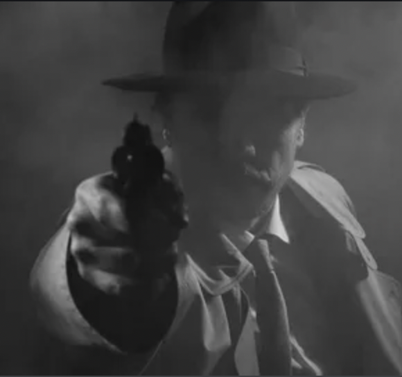

# Henderson Hogue - Agent federalny

## Sesje
[Sesje](#opisy-sesji) mozna znalezc tutaj:
<ul>
	<li>[Sesja 1](#sesja-1)</li>
</ul>

## Postac

### EQ

<ul>
	<li>6 strzalowy rewolwer .45 colt zrobiony przez mojego ojca rusznikarza</li>
	<li>M1 Garand bron z ktorej korzystalem z trakcie I WS, modyfikowana na bron snajperska (specjalne uchwyty, podpolicznik, zdobienia itd)</li>
	<li>Czarny kapelusz</li>
	<li>Krawat czarny</li>
	<li>Biala wymieta koszula</li>
	<li>Odznaka, przetarta</li>
	<li>Czarny plaszcz</li>
	<li>stary Ford T</li>
	<li>Zniszczona kawalerka w kiepksiej dzielnicy miasta</li>
</ul>

### Opis postaci

//TODO

### Ideologia/Przekonania

<b>Polityka - liberalizm</b>. 
Bron, wolnosc, ojczyzna, rodzina. Prawo powinno byc wykonywane przez ludzi a nie przez nieosobowy rzad - jestem agentem federalnym ktory nie lapie przestepcow tylko ich karze (jeden z tych co co chwila trafiaja do swojego przelozonego bo cos odjebal ale nie zostaje wyrzucony bo jestem naprawde dobry w tym co robie)

### Wazne osoby

<b>Rodzenstwo - zdrada, zemsta</b> 
Starszy brat, Aldwin Houge, byl malym zlodziejaszkiem w okolicy, ukradl ojcu bron z szafki. Wrocil pewnego dnia do domu i wdal sie w klotnie z ojcem, zastrzelil matke i zbiegl z domu, ojciec pare tygodni pozniej sie powiesil.

### Znaczace miejsca

<b>Miejsce cichej kontemplacji</b> 
Grob tragicznie zmarlej matki

### Rzeczy osobiste

<b>Bron</b> 
Rusznikarski rewolwer .45 colt mojego ojca

## Przymioty

<b>Uznanie, mistrz w fachu</b> 
Idealny strzelec, miejska dzungla jest jego podworkiem

## Urazy/Blizny

## Fobie/Manie

## Tajemne ksiegi, zaklecia i artefakty

## Spotkania z dziwnymi istotami

## Opisy sesji

### Sesja 1